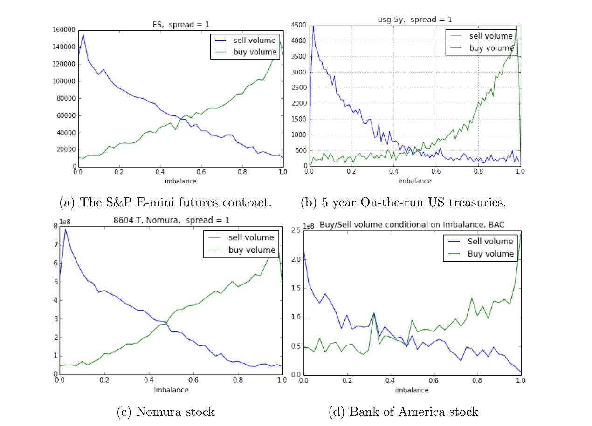
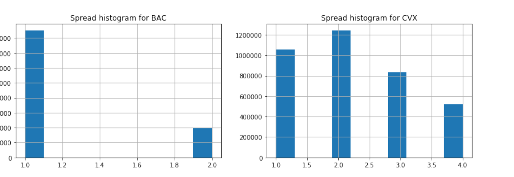
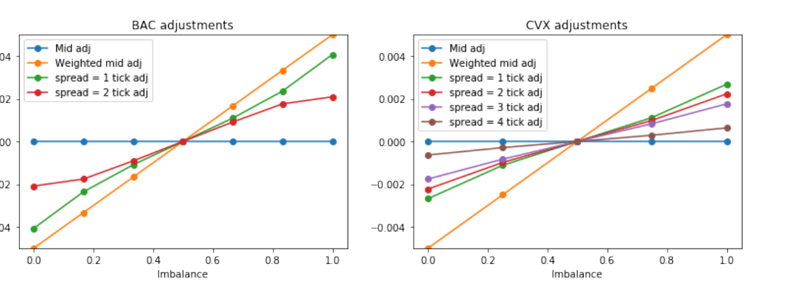
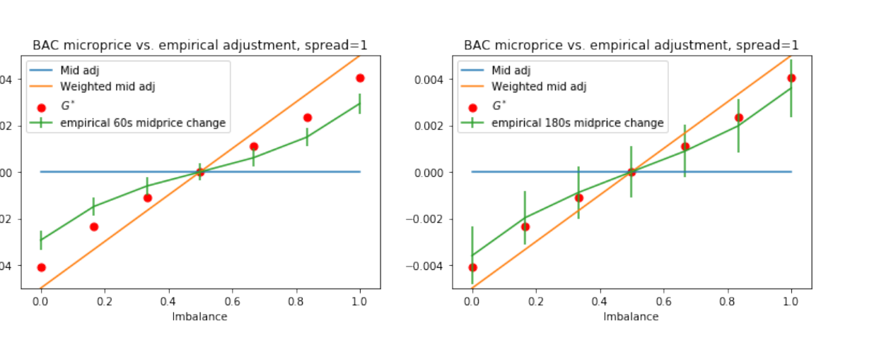
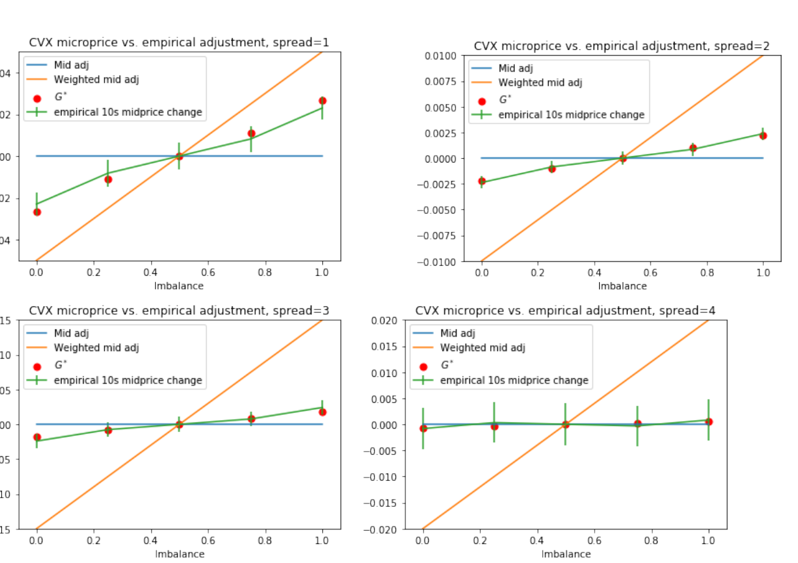

# The Micro-Price: A High Frequency Estimator of Future Prices

**Sasha Stoikov**  
Cornell Financial Engineering Manhattan  
2 W Loop Rd, New York, NY 10044

**Date:** April 18, 2018
**Tags: PUBLIC-HL,L2,BBO,SHORT-ALPHA**

## Abstract

I define the micro-price to be the limit of a sequence of expected mid-prices and provide conditions for this limit to exist. The micro-price is a martingale by construction and can be considered to be the 'fair' price of an asset, conditional on the information in the order book. The micro-price may be expressed as an adjustment to the mid-price that takes into account the bid-ask spread and the imbalance. The micro-price can be estimated using high frequency data. I show empirically that it is a better predictor of short term prices than the mid-price or the weighted mid-price.

**Keywords:** Market Microstructure, High-Frequency Trading, Micro-Price, Short Term Price Prediction, Limit Order Book, Liquidity  
**JEL Classification:** G10

<!-- source: page 1 -->

# 1. Introduction

The term High Frequency Trading (HFT) has been used loosely to describe the activities of a large variety of players in modern financial markets. HFTs are blamed for many ills in the markets[^1] but are also known to conduct many legitimate trading strategies that have existed since the days of floor trading.[^2]

One feature that all HFTs have in common is a computing technology (hardware and software) that allows firms to trade at speeds where mere humans cannot compete. HFTs may react to every quote update and make lightning-fast decisions such as when to submit or cancel orders. These decisions are based on checking whether certain signals cross certain thresholds. These signals may combine private data sources and public data that everyone has access to. In this paper, I will focus on the public data that is available to HFTs who observe the order book in real time.

The order book is the dominant system currently used by modern financial markets. This system matches orders on a price-time priority and keeps track of all previously submitted buy and sell limit orders on a discrete grid of prices. Though all orders are anonymous, traders may see the sizes of orders at each price level, thus getting a sense of instantaneous supply and demand in the market.

The most natural quantity to build from these feeds is the mid-price:

$$
M = \frac{1}{2}\left(P^a + P^b\right).
\tag{1}
$$

where $P^b$ is the best (highest) bid price and $P^a$ is the best (lowest) ask price. This measure is one of the most accepted notions of 'fair' price in the market. The mid-price suffers from a few drawbacks. First, it has been reported that changes in the mid-price are highly auto-correlated, an effect known as the bid-ask bounce. Second, it changes relatively infrequently compared to the rate of quote updates, making it a relatively low frequency signal. Third, it does not make use of the volume at the best bid and ask prices. Researchers in high frequency volatility estimation have documented these problems with mid-price data and have developed econometric techniques to filter out what they call 'microstructure noise' (see Hansen and Lunde 2006 and Ait-Sahalia et al. 2011).

An interesting side effect of the transparency of the limit order book is that the volume at the best bid and ask prices provide a strong signal of the next price move. To improve upon the mid-price, practitioners also pay close attention to the weighted mid-price:

$$
W = I P^a + (1-I)P^b.
\tag{2}
$$

where the weight $I$ is given by the imbalance

$$
I = \frac{Q^b}{Q^b + Q^a}.
\tag{3}
$$

where $Q^b$ is the bid size (total volume at the best bid) and $Q^a$ is the ask size.

Why should the volume at the best bid and ask prices matter? In Figure 1, using trades and quotes on a variety of assets, I show that the imbalance is a very strong predictor of the next traded price. This feature of imbalances has been reported by a variety of researchers (Kearns et al. 2006; Avellaneda et al. 2011; Burlakov et al. 2012; Harris 2013; Lipton et al. 2013; Jaimungal et al. 2015; Gould and Bonart 2015; Lehalle and Mounjid 2016; Stoikov and Waeber 2016; Goldstein et al. 2017; Hagstromer 2017; Kanagal et al. 2017).

**Figure 1.** Buy and sell volume conditional on (pre-trade) imbalance. The spread is equal to the tick size (i.e. 1 tick) for each asset: (a) the S&P E-mini futures contract, (b) 5 year on-the-run US treasuries, (c) Nomura stock, and (d) Bank of America stock.

The weighted mid-price also suffers from a few drawbacks. First, because the weighted mid-price changes on every update of the imbalance, it has been reported to be quite noisy for the purpose of high frequency volatility estimation (Gatheral and Oomen 2010; Robert and Rosenbaum 2012). Second, there is no theoretical justification for the weighted mid-price to be considered a 'fair' price, since it is not necessarily a martingale. Third, in practice it suffers from some counter intuitive features.

For instance, assume $P^b=\$10.00$, $Q^b=9$, $P^a=\$10.02$, and $Q^a=27$. At this moment in time, the weighted mid-price is

$$
\$10.005
= \frac{9}{9+27}\cdot 10.02
+ \left(1-\frac{9}{9+27}\right)\cdot 10.00.
$$

However, if a sell order of size one arrives at $\$10.01$, the new weighted mid-price will be updated upward to

$$
\$10.009
= \frac{1}{1+9}\cdot 10.01
+ \left(1-\frac{1}{1+9}\right)\cdot 10.00.
$$

The impact of a new sell order should surely be to update the 'fair' price downward, not upward.

As demonstrated above, the mid-price and weighted mid-price have a number of drawbacks. Some researchers have proposed alternative definitions of a microstructure price that is directly related to the bid ask prices and sizes. For example, Lillo and Bonart (2016) compare statistical properties of various efficient price definitions for large tick stock. They find that an explicit formula based on rebate-adjusted bid and ask sizes performs well in terms of low autocorrelation and well behaved price impact functions. In Jaisson (2015), the fair price is defined in terms of the conditional expectation of the next traded prices. This idea is taken further in Lehalle and Mounjid (2016), who define the micro-price in terms of a limit of expected future mid-prices, conditional on the current mid-price and imbalance.

In this spirit, I define a notion of price, that I call the **micro-price**:

$$
P^{\mathrm{micro}} = M + g(I,S).
\tag{4}
$$

where $M$ is the mid-price, $I$ is the imbalance and $S$ is the bid-ask spread given by

$$
S = P^a - P^b.
$$

The focus of this paper is to estimate the function $g$ that should be applied to the mid-price to get a fair microstructure price.

The micro-price is a martingale by construction and can be theoretically viewed as the fair price of the asset, conditional on the state of the order book. Furthermore, it can be estimated from past order book data and can be computed numerically very fast. Finally, I show empirically that it is a better predictor of near term prices than the mid-price or the weighted mid-price.

[^1]: The flash crash of May 6, 2010, front running, market manipulation and spoofing.
[^2]: Optimal order splitting, pairs trading, statistical arbitrage, market making, liquidity provision, latency arbitrage and sentiment analysis of news.

<!-- source: pages 4-6 -->

# 2. General Framework

I first consider predictions of the $i$-th mid-price:

$$
P_t^i = \mathbb{E}\left[M_{\tau_i}\mid \mathcal{F}_t\right].
$$

where stopping times $\tau_1,\ldots,\tau_n$ represent the times when the mid-price $M_t$ changes, i.e.

$$
\tau_1 = \inf\left\{u>t\mid M_u-M_{u-}\neq 0\right\}
$$

and

$$
\tau_{i+1} = \inf\left\{u>\tau_i\mid M_u-M_{u-}\neq 0\right\},
$$

and $\mathcal{F}_t$ is the information contained in the order book at time $t$. By construction, the processes $P_t^i$ are martingales up to the stopping times $\tau_i$.

The micro-price is the limit

$$
P_t^{\mathrm{micro}} = \lim_{i\to\infty} P_t^i,
$$

and therefore $P_t^{\mathrm{micro}}$, if it exists, is a martingale for all times $t>0$.

The reasons for taking the limit of expected mid prices as time goes to infinity is twofold. First, our construction of the micro-price is horizon independent, which is a desirable feature when comparing various assets that may trade at different frequencies. Second, by taking expectations of mid prices far into the future, the microstructure noise inherent in the mid price gets filtered out.

To proceed with the analysis, I will make two assumptions. The first assumption will explicitly model the filtration in terms of three state variables.

**Assumption 1.** The information in the order book is given by the filtration generated by the 3 dimensional Markov process

$$
\mathcal{F}_t = \sigma(M_t,I_t,S_t),
$$

where

$$
M_t = \frac{1}{2}\left(P_t^b+P_t^a\right)
$$

is the mid-price,

$$
S_t = \frac{1}{2}\left(P_t^a-P_t^b\right)
$$

is the bid-ask spread, and

$$
I_t = \frac{Q_t^b}{Q_t^b+Q_t^a}
$$

is the imbalance at the top of the order book.

This assumption may be generalized to include more state variables, say generated by Level II data, but I choose to focus on Level I data. The next assumption reduces the state space of the Markov model to a bounded state space.

**Assumption 2.** The expected mid price increments are independent of the mid price level:

$$
\mathbb{E}\!\left[
M_{\tau_i}-M_{\tau_{i-1}}
\mid M_t=M, I_t=I, S_t=S
\right]
=
\mathbb{E}\!\left[
M_{\tau_i}-M_{\tau_{i-1}}
\mid I_t=I, S_t=S
\right],
\qquad t\le \tau_{i-1}.
$$

This assumption ensures that the dynamics of the price is the same at each tick. The mid-price predictions can be expressed in terms of the three state variables.

## Theorem 2.1

Given Assumptions 1 and Assumption 2, the prediction of the $i$-th mid-price can be written as

$$
P_t^i = M_t + \sum_{k=1}^{i} g^k(I_t,S_t).
\tag{5}
$$

where

$$
g^1(I,S)
= \mathbb{E}\left[M_{\tau_1}-M_t\mid I_t=I,S_t=S\right]
$$

is the first order micro-price adjustment. The $i+1$-th order micro-price adjustment

$$
g^{i+1}(I,S)
= \mathbb{E}\left[g^i(I_{\tau_1},S_{\tau_1})\mid I_t=I,S_t=S\right],
\qquad \forall i\ge 0
\tag{6}
$$

can be computed recursively.

### Proof

Let us first define

$$
g^i(I,S)
= \mathbb{E}\left[
M_{\tau_i}-M_{\tau_{i-1}}
\mid I_t=I,S_t=S
\right],
\qquad t\le \tau_{i-1},
$$

where $\tau_0=t$. The first mid price prediction can be written as

$$
\begin{aligned}
P_t^1
&:= \mathbb{E}[M_{\tau_1}\mid\mathcal{F}_t] \\
&= \mathbb{E}[M_t\mid M_t,I_t,S_t]
 + \mathbb{E}[M_{\tau_1}-M_t\mid M_t,I_t,S_t]
 &&\text{Assumption 1}\\
&= M_t + \mathbb{E}[M_{\tau_1}-M_t\mid I_t,S_t]
 &&\text{Assumption 2}\\
&= M_t + g^1(I_t,S_t)
 &&\text{Definition.}
\end{aligned}
$$

The $i$-th mid price prediction can be written as a telescoping sum

$$
\begin{aligned}
P_t^i
&:= \mathbb{E}[M_{\tau_i}\mid\mathcal{F}_t]\\
&= \mathbb{E}[M_t\mid M_t,I_t,S_t]
 + \sum_{k=1}^{i}
   \mathbb{E}[M_{\tau_k}-M_{\tau_{k-1}}\mid M_t,I_t,S_t]
 &&\text{Assumption 1}\\
&= \mathbb{E}[M_t\mid M_t,I_t,S_t]
 + \sum_{k=1}^{i}
   \mathbb{E}[M_{\tau_k}-M_{\tau_{k-1}}\mid I_t,S_t]
 &&\text{Assumption 2}\\
&= M_t + \sum_{k=1}^{i} g^k(I_t,S_t)
 &&\text{Definition.}
\end{aligned}
$$

The recursive relation (6) can be proved by conditioning on information right after the first price move:

$$
\begin{aligned}
g^{i+1}(I,S)
&= \mathbb{E}[M_{\tau_{i+1}}-M_{\tau_i}\mid I_t=I,S_t=S]\\
&= \mathbb{E}\!\left[
    \mathbb{E}[M_{\tau_{i+1}}-M_{\tau_i}\mid S_{\tau_1},I_{\tau_1}]
    \mid I_t=I,S_t=S
  \right]\\
&= \mathbb{E}[g^i(I_{\tau_1},S_{\tau_1})\mid I_t=I,S_t=S],
\qquad i\ge 1.
\end{aligned}
$$

Theorem 1 provides a tool to recursively compute a sequence of mid-price predictions. Note that, even if it does converge, there is no guarantee that it converges to a value that is between the bid and the ask price.

<!-- source: pages 6-8 -->

# 3. Finite state space example

In order to explicitly compute the micro-price, the dynamics of the triplet $(M_t,I_t,S_t)$ needs to be made explicit. I show in Appendix A that if $I_t$ is independent of $M_t$, the micro-price coincides with the mid price. Furthermore, I show in Appendix B that if $I_t$ is a Brownian motion and behaves in a particular way at the boundary, the micro-price coincides with the weighted mid price.

Although these two examples are simple and theoretically justify the use of the mid-price and weighted mid-price, they fall short empirically. For example they fail to capture differences in microstructure from one asset to the other. In this section, I introduce a non-trivial implementation of a micro-price model and in Section 4, I show that this model fits the data well.

Assume the time step is now discrete with $t\in\mathbb{Z}^+$, the imbalance $I_t$ takes discrete values $1\le i\le n$ and the spread $S_t$ takes discrete values $1\le s\le m$. Note that the imbalance can be discretized by defining

$$
I_t = \sum_{j=1}^{n}
 j\,\mathbf{1}\!\left(
   \frac{j-1}{n}
   < \frac{Q_t^b}{Q_t^b+Q_t^a}
   \le \frac{j}{n}
 \right).
$$

The spread $S_t$ can be expressed in number of ticks. The mid-price changes $M_{t+1}-M_t$ take values in

$$
K = [-0.01,-0.005,0.005,0.01]^T.
$$

Note that I use half ticks, since when the bid or the ask move by one cent, the mid moves by half a cent. To simplify notation, I will use the double index $x=(i,s)$ to represent the state space of the pair of variables $X_t=(I_t,S_t)$.

The first adjustment to the micro-price can be computed using standard techniques for discrete time Markov processes with absorbing states (Hoel et al. 1972):

$$
\begin{aligned}
G^1(x)
&= \mathbb{E}[M_{\tau_1}-M_t\mid X_t=x]\\
&= \sum_{k\in K} k\cdot \mathbb{P}(M_{\tau_1}-M_t=k\mid X_t=x)\\
&= \sum_{k\in K}\sum_u
   k\cdot \mathbb{P}(M_{\tau_1}-M_t=k\ \wedge\ \tau_1-t=u\mid X_t=x).
\end{aligned}
$$

I define probabilities of the absorbing states

$$
R_{xk} := \mathbb{P}(M_{t+1}-M_t=k\mid X_t=x)
$$

and the transient states

$$
Q_{xy} := \mathbb{P}(M_{t+1}-M_t=0\ \wedge\ X_{t+1}=y\mid X_t=x).
$$

Note that $R$ is an $nm\times 4$ matrix and $Q$ is an $nm\times nm$ matrix. The first order micro-price adjustment can now be written in terms of these transition matrices:

$$
G^1(x)
= \left(\sum_s Q^{s-1}R\right)K
= (1-Q)^{-1}RK.
$$

In order to compute the recursion formula

$$
G^{i+1}(x)
= \mathbb{E}[G^i(X_{\tau_1})\mid X_t=x],
\tag{7}
$$

in matrix form, I define a new matrix of absorbing states

$$
T_{xy} := \mathbb{P}(M_{t+1}-M_t\neq 0\ \wedge\ X_{t+1}=y\mid X_t=x).
$$

Once again applying standard techniques for discrete time Markov processes with absorbing states,

$$
G^{i+1}(x)
= \left(\sum_s Q^{s-1}T\right)G^i(x)
= (1-Q)^{-1}T G^i(x).
$$

Define

$$
B := (1-Q)^{-1}T
$$

and note that this is an $nm\times nm$ matrix. It follows that the $i$-th mid price prediction in equation (5) can be expressed in terms of powers of this matrix:

$$
P_t^i = M_t + \sum_{k=0}^{i} B^k G^1.
$$

Although the above expression provides a method to compute the micro-price, there is no guarantee that it will converge. In fact, if the matrices $Q$, $R$ and $T$ are not estimated carefully, one may incorporated drifts in the data and the sequence $P^i$ may blow up. The following theorem establishes a condition for the convergence of the micro-price.

## Theorem 3.1

If

$$
B^* = \lim_{k\to\infty} B^k
$$

and $B^*G^1=0$, then the limit

$$
\lim_{i\to\infty}P_t^i=P_t^{\mathrm{micro}}
$$

converges.

### Proof

The matrix $B$ is a regular stochastic matrix so it can be decomposed

$$
B = B^* + \sum_{j=2}^{nm} \lambda_j B_j,
$$

where $B^*$ is the unique stationary distribution and the eigenvalues $|\lambda_j|<1$ and $B_j=f_j\pi_j$ where $f_j$ and $\pi_j$ are the left and right eigenvectors of $B$. This is a spectral representation of matrix $B$ that is known as the Perron Frobenius Theorem. Therefore,

$$
P_t^i
= M_t + \sum_{k=0}^{i} B^kG^1
= M_t + G^1 + \sum_{k=1}^{i}(B^k-B^*)G^1
$$

follows from the assumption that $B^*G^1=0$. Note that

$$
B^k = B^* + \sum_{j=2}^{nm}\lambda_j^k B_j
$$

for $k\ge 1$. Therefore

$$
\begin{aligned}
P_t^i
&= M_t+G^1+
   \sum_{k=1}^{i}
   \left(\sum_{j=2}^{nm}\lambda_j^kB_j\right)G^1\\
&= M_t+G^1+
   \sum_{j=2}^{nm}
   \left(\sum_{k=1}^{i}\lambda_j^k\right)B_jG^1.
\end{aligned}
$$

The micro-price can be written explicitly in terms of these matrices:

$$
P_t^{\mathrm{micro}}
= \lim_{i\to\infty}P_t^i
= M_t+G^1+
  \sum_{j=2}^{nm}\frac{\lambda_j}{1-\lambda_j}B_jG^1,
$$

and therefore converges to a finite value.

<!-- source: pages 8-11 -->

# 4. Data analysis

I will be using bid and ask quotes for Bank of America (BAC) and Chevron (CVX), for the month of March 2011. The timestamp is rounded to the nearest second and each row has the bid price, ask price, bid size and ask size. BAC and CVX have a very different microstructure.

**Figure 2.** Spread histograms for BAC and CVX. BAC is a typical large tick stock and CVX is a typical small tick stock.

Looking at the spread histograms for these two stocks in Figure 2, one can see that BAC has a spread of 1 tick most of the time, while CVX has a wider spread distribution. Moreover, BAC mid-price changes happen much less frequently than for CVX. Stocks like BAC are often referred to as large tick stocks, while stocks like CVX are referred to as small tick stocks. This difference in the microstructure is largely due to the fact that BAC trades at lower prices than CVX and the tick size of 1 cent is a larger percentage of the price for BAC. These two stocks therefore illustrate the flexibility of the micro-price model presented in Section 3.

For each time stamp $t$, I compute the imbalance $I_t$ and the spread $S_t$. The imbalance and the spread are discretized into a finite number of states $1\le x\le nm$ (recall that $n$ represents the number of states of $I_t$ and $m$ represents the number of states of $S_t$). For each time stamp, I compute the mid-price change

$$
dM_t = M_{t+1}-M_t,
$$

which is most often zero.

The estimation procedure is as follows:

1. **Symmetrize the data.** For every observation (the tuple $(I_t,S_t,I_{t+1},S_{t+1},dM)$) there is a corresponding symmetric observation (the tuple $(1-I_t,S_t,1-I_{t+1},S_{t+1},-dM)$). The symmetrizing procedure ensures that $B^*G^1=0$ and that the micro-price converges as guaranteed by Theorem 3.1.
2. **Estimate transition probabilities** $Q$, $T$ and $R$. Recall that these matrices are $nm\times nm$, $nm\times nm$ and $nm\times 4$ respectively.
3. Compute
   $$
   G^1=(1-Q)^{-1}RK.
   $$
4. Compute
   $$
   B=(1-Q)^{-1}T.
   $$
5. Compute the micro-price adjustment:
   $$
   G^* = P^{\mathrm{micro}}-M
       = G^1 + \sum_{i=1}^{\infty}B^iG^1.
   $$

In practice, this sum converges very fast. Note that $G^*$ is a vector of size $nm$ which we will graph as $m$ vectors of size $n$, one for each spread value.

**Figure 3.** $G^*=P^{\mathrm{micro}}-M$ for BAC and CVX.

Looking at Figure 3, one can see that the micro-price adjustments for BAC and CVX fall somewhere between the mid-price (a horizontal line) and the weighted mid-price (a line with left intercept $-0.005$ and right intercept $0.005$). The micro-price adjustment is less than half a spread, which indicates that the micro-price lives between the bid and the ask, though this is not a-priori imposed by the model. Note that as the spread widens, the slope of the micro-price as a function of imbalance lessens, i.e. imbalances are less informative. Also, notice that the micro-price adjustment is larger for a large tick stock like BAC than for a small tick stock like CVX.

The micro-price is horizon-independent, so there is an inherent difficulty in proving that it is a good predictor of future prices. To empirically determine its effectiveness in predicting future prices, one needs to choose a given time scale. If the time scale is too short, the empirical price changes will suffer from microstructure noise, i.e. autocorrelation effects. If the time scale is too large, the empirical price changes will be noisy and their 95% confidence intervals will be large. In the sequel, we will see that for BAC, a 3 minute horizon captures the behavior at infinity well, while for CVX, a 10 second horizon seems to be long enough. Estimating the appropriate horizon for different stocks is beyond the scope of this work.

**Figure 4.** $G^*=P_t^{\mathrm{micro}}-M_t$ vs. empirical price changes for BAC at 1 minute and 3 minute horizons.

In Figure 4, I compare micro-price adjustments for BAC to empirical price changes over 1 minute and 3 minute intervals, conditional on the imbalance. The spread is conditioned to be the minimal tick size of $\$0.01$. Notice that the micro-price is closer to the weighted mid-price than the mid-price ($G^*$ is closer to the weighted mid-price adjustment than the mid-price adjustement). At the 1 minute time scale, the empirical mid-price change is of smaller magnitude than the micro-price adjustment would imply. This effect is due to negative autocorrelations in mid-price moves. Upward moves in the mid-price are often followed by downward moves. At the 3 minute time scale, the BAC microstructure noise effects dissipate and the micro-price adjustment fall within the 95% confidence intervals. Naturally, the confidence intervals are now larger, since we have less data points, and validating the micro-price at longer time horizons may not be realistic for this 1 month data set.

**Figure 5.** $G^*=P_t^{\mathrm{micro}}-M_t$ vs. 10 second empirical price changes for CVX.

In Figure 5, I compare CVX micro-price adjustments to empirical price changes over 10 second price changes, conditional on the imbalance and four values of the spread. At this time scale, the micro-price adjustment already coincides with the empirical price changes. It has been reported that microstructure noise effects are less important for such small tick stock (see Lillo and Bonart 2016) and the fact that these effects disappear much faster for CVX than BAC seem to support that view. Also note that when the spread is 4 ticks, the micro-price is indistinguishable from the mid-price and the imbalance seems to have no additional information.

Figures 4 and 5 indicate that the micro-price model is a better predictor of mid-price changes than either the mid or weighted mid-prices. When analyzing the predictive power of order book variables, the choice of the time horizon is rather arbitrary and a reasonable choice may be different for different assets. Short term horizons are subject to more microstructure bias, while longer term horizon predictions are more noisy. Working with the micro-price allows one to avoid making such ad-hoc choices when attempting to choose an appropriate horizon.

<!-- source: page 12 -->

# 5. Conclusions

I have defined the micro-price as a limit of expected mid-prices in the distant future. In the example case of a discrete time, finite state Markov model, I have derived conditions that ensure this micro-price converges. This model can be fitted to Level-I data. I have shown empirically that the micro-price is a better predictor of short term price moves than the mid-price or the weighted mid-price for two stocks with very different microstructure.

Using the micro-price can be useful to any HFT that needs to incorporate order book information in their trading models. The general framework can accommodate for more state variables such as private sources of alpha. It can be therefore used to improve upon algorithms for optimal order splitting, pairs trading, statistical arbitrage, market making, liquidity provision and latency arbitrage to name a few.

# References

- Ait-Sahalia, Y., Mykland, P. A. and Zhang. *Ultra high frequency volatility estimation with dependent microstructure noise*, Journal of Econometrics, Elsevier, vol. 160(1), pages 160-175, January.
- Avellaneda, M., Reed, J. and Stoikov, S. *Forecasting prices from level-1 quotes in the presence of hidden liquidity*. Algorithmic Finance 2011, 1.
- Burlakov, Y., Kamal, M. and Salvadore, M. *Optimal limit order execution in a simple model for market microstructure dynamics*. Available online at `https://papers.ssrn.com/sol3/papers.cfm?abstract_id=2185452`.
- Gatheral, J. and Oomen, R. C. A. *Zero-intelligence realized variance estimation*. Finance and Stochastics 2010, 14.2, 249-283.
- Gould, M. G. and Bonart, J. *Queue Imbalance as a One-Tick-Ahead Price Predictor in a Limit Order Book*. Available online at `https://arxiv.org/abs/1512.03492`.
- Goldstein, Michael A., Kwan, Amy and Philip, Richard. *High-Frequency Trading Strategies*. Available at SSRN: `https://ssrn.com/abstract=2973019`.
- Hagstromer, B. *Overestimated Effective Spreads: Implications for Investors*. Available online at `https://papers.ssrn.com/sol3/papers.cfm?abstract_id=2939579`.
- Hansen, P. R. and Lunde, A. *Realized Variance and Market Microstructure Noise*. Journal of Business & Economic Statistics, Vol. 24, No. 2 (Apr., 2006), pp. 127-161.
- Harris, L. *Maker-Taker Pricing Effects on Market Quotations*. Available online at `http://bschool.huji.ac.il/.upload/hujibusiness/Maker-taker.pdf`.
- Hoel, P., Port, S. and Stone, C. *Introduction to Stochastic Processes*. 1972, Waveland Press, Inc., Prospect Heights, Illinois.
- Cartea, A., Donnelly, R. and Jaimungal, S. *Enhancing Trading Strategies with Order Book Signals*. Available at SSRN: `https://ssrn.com/abstract=2668277`.
- Jaisson, T. *Liquidity and Impact in Fair Markets*. Available online at `https://arxiv.org/abs/1506.02507`.
- Kallsen, J. and Muhle-Karbe, J. *On Using Shadow Prices in Portfolio Optimization with Transaction Costs*. The Annals of Applied Probability Vol. 20, No. 4 (August 2010), pp. 1341-1358.
- Kanagal, K., Wu, Y. and Chen, K. *Market Making with Machine Learning Methods*. Available online at `https://web.stanford.edu/class/msande448/2017/Final/Reports/gr4.pdf`.
- Nevmyvaka, Y., Feng, Y. and Kearns, M. *Reinforcement Learning for Optimized Trade Execution*. Available online at `https://www.cis.upenn.edu/~mkearns/papers/rlexec.pdf`.
- Lehalle, Charles-Albert and Mounjid, Othmane. *Limit Order Strategic Placement with Adverse Selection Risk and the Role of Latency*. Available online at `https://arxiv.org/pdf/1610.00261.pdf`.
- Lillo, F. and Bonart, J. *A continuous and efficient fundamental price on the discrete order book grid*. Available online at `https://papers.ssrn.com/sol3/papers.cfm?abstract_id=2817279`.
- Lipton, A., Pesavento, U. and Sotiropoulos, M. G. *Trade arrival dynamics and quote imbalance in a limit order book*. Available online at `https://arxiv.org/pdf/1312.0514.pdf`.
- Rosenbaum, M. and Robert, C. Y. *On Volatility and Covariation Estimation when Microstructure Noise and Trading Times are Endogenous*. Mathematical Finance, 22: 133-164.
- Stoikov, S. and Waeber, R. *Reducing transaction costs with low-latency trading algorithms*. Quantitative Finance 16.9, 1445-1451. Available at `http://dx.doi.org/10.1080/14697688.2016.1151926`.

<!-- source: pages 13-14 -->

# Appendix A: Mid-price example

The following assumptions ensure that the micro-price coincides with the mid-price:

- The spread $S_t$ is fixed at 1 tick.
- The process $M_t$ is a continuous time random walk. The jumps are binomial and symmetric, i.e. $M_{\tau_{i+1}}-M_{\tau_i}$ takes values in $(-1,1)$, have up and down probabilities of $0.5$.
- $M_s-M_t$ is independent of $I_t$ for all $s>t$.

Since

$$
g^1(I_t,S_t)
= \mathbb{E}[M_{\tau_1}-M_t\mid M_t,I_t,S_t]
= 1\cdot\frac{1}{2}-1\cdot\frac{1}{2}
=0,
$$

it follows from the recursion relation (6) that

$$
P_t^i=M_t,\qquad \forall i\ge 0.
$$

This simple toy model illustrates that if $I_t$ is independent of future price moves, it has no value for price prediction and the mid-price is the best predictor of future prices and is equal to the micro-price.

# Appendix B: Weighted mid-price example

The following assumptions ensure that the micro-price coincides with the weighted mid-price:

- The spread $S_t$ is fixed at 1 tick.
- The process $I_t$ is a Brownian motion on the interval $[0,1]$.
- Let
  $$
  \tau_{\mathrm{down}}=\inf\{s>t:I_s=0\},\qquad
  \tau_{\mathrm{up}}=\inf\{s>t:I_s=1\},
  $$
  and $\tau_1=\min(\tau_{\mathrm{up}},\tau_{\mathrm{down}})$.
- When $I_t$ is absorbed to 1, the mid-price jumps up $M_{\tau_1}-M_t=1$ and $I_{\tau_1}=\epsilon$ with probability 0.5 or $M_{\tau_1}-M_t=0$ and $I_{\tau_1}=1-\epsilon$ with probability 0.5.
- When $I_t$ is absorbed to 0, the mid-price jumps down $M_{\tau_1}-M_t=-1$ and $I_{\tau_1}=1-\epsilon$ with probability 0.5 or $M_{\tau_1}-M_t=0$ and $I_{\tau_1}=\epsilon$ with probability 0.5.
- The process $I_t$ is reset at its new value ($\epsilon$ or $1-\epsilon$) and starts anew.

The first adjustment to the micro-price is given by

$$
\begin{aligned}
g^1(I_t,S_t)
&=g^1(I_t)
=\mathbb{E}[M_{\tau_1}-M_t\mid I_t]\\
&=\frac{1}{2}\,\mathbb{P}[I_{\tau_1}=1\mid I_t]
 -\frac{1}{2}\,\mathbb{P}[I_{\tau_1}=0\mid I_t]\\
&=I_t-\frac{1}{2}.
\end{aligned}
$$

where the last equality follows from classic results on hitting times of Brownian motions. The second adjustment to the micro-price is given by

$$
\begin{aligned}
g^2(I_t,S_t)
&=\mathbb{E}[g^1(I_{\tau_1})\mid I_t]\\
&=\mathbb{E}\left[I_t-\frac{1}{2}\mid I_t\right]\\
&=\frac{1}{2}\epsilon
 -\frac{1}{2}(1-\epsilon)
 -\frac{1}{2}
=0.
\end{aligned}
$$

It follows from the recursion relation (6) that all subsequent $g^i=0$, $\forall i>2$. Hence, the limit exists and the micro-price coincides with the weighted mid-price. Also note that as $\epsilon$ tends to zero, this micro-price model converges to Brownian motion.
