# The price impact of order book events

**Rama Cont, Arseniy Kukanov and Sasha Stoikov**  
**March 2011**
**Tags: PUBLIC-HL,L2,TRADES**

> Conversion note: equations have been transcribed as LaTeX; figures/diagrams are preserved as PNG assets; the large empirical tables are available in [`tables.md`](tables.md) and as CSV files under [`tables/`](tables/). The wording and notation below follow the uploaded paper.

## Abstract

We study the price impact of order book events - limit orders, market orders and cancelations - using the NYSE TAQ data for 50 U.S. stocks. We show that, over short time intervals, price changes are mainly driven by the order flow imbalance, defined as the imbalance between supply and demand at the best bid and ask prices. Our study reveals a linear relation between order flow imbalance and price changes, with a slope inversely proportional to the market depth. These results are shown to be robust to seasonality effects, and stable across time scales and across stocks. We argue that this linear price impact model, together with a scaling argument, implies the empirically observed "square-root" relation between price changes and trading volume. However, the relation between price changes and trade volume is found to be noisy and less robust than the one based on order flow imbalance.

## Contents

1. [Introduction](#1-introduction)
   - [1.1 Summary](#11-summary)
   - [1.2 Outline](#12-outline)
2. [A model for the price impact of orders](#2-a-model-for-the-price-impact-of-orders)
   - [2.1 Variables](#21-variables)
   - [2.2 A stylized model of the order book](#22-a-stylized-model-of-the-order-book)
   - [2.3 Model specification](#23-model-specification)
3. [Estimation and results](#3-estimation-and-results)
   - [3.1 The trades and quotes (TAQ) data](#31-the-trades-and-quotes-taq-data)
   - [3.2 Empirical findings](#32-empirical-findings)
   - [3.3 Intraday patterns](#33-intraday-patterns)
4. [Price impact of trades](#4-price-impact-of-trades)
   - [4.1 Trade imbalance vs order flow imbalance](#41-trade-imbalance-vs-order-flow-imbalance)
   - [4.2 Does volume move the prices?](#42-does-volume-move-the-prices)
5. [Conclusion](#5-conclusion)
6. [References](#references)
7. [Appendix: TAQ data processing](#appendix-taq-data-processing)

# 1 Introduction

The availability of high-frequency records of trades and quotes has stimulated an extensive empirical and theoretical literature on the relation between order flow, liquidity and price movements in order-driven markets. A particularly important issue for applications is the impact of orders on prices: the optimal liquidation of a large block of shares, given a fixed time horizon, crucially involves assumptions on price impact (see Bertsimas and Lo [6], Almgren and Chriss [2], Obizhaeva and Wang [35]).

Various models for price impact have been proposed in the literature but there is little agreement on how to model it [7]. In the empirical literature, price impact has been described by various authors as linear, non-linear, square root, virtual, mechanical, temporary, instantaneous, permanent or transient. The only consensus seems to be the intuitive notion that imbalance between supply and demand moves prices.

The empirical literature on price impact has primarily focused on trades. One approach is to study the impact of "parent orders" gradually executed over time using proprietary data (see Engle et al. [14], Almgren et al. [3]). Alternatively, empirical studies on public data [16, 18, 20, 28, 29, 43, 38, 39] have investigated the relation between the direction and sizes of trades and price changes and typically conclude that the price impact of trades is an increasing, concave ("square root") function of their size. This focus on trades leaves out the information in quotes, which provide a more detailed picture of price formation [15], and raises a natural question: is volume of trades truly the best explanatory variable for price movements in markets where many quote events can happen between two trades?

Understanding the price impact of orders is also important from a theoretical perspective, in the context of optimal order execution. Huberman and Stanzl [25] show that there are arbitrage opportunities if the effect of trades on prices is permanent and the impact is non-linear; Gatheral [19] extends this analysis by showing that if the price impact function is non-linear, impact needs to decay in a particular way to exclude arbitrage. Bouchaud et al. [9] associated the decay of price impact of trades with limit orders, arguing that there is a "delicate interplay between two opposite tendencies: strongly correlated market orders that lead to super-diffusion (or persistence), and mean reverting limit orders that lead to sub-diffusion (or anti-persistence)". This insight implies that looking solely at trades, without including the effect of limit orders amounts to ignoring an important part of the price formation mechanism.

There is ample evidence that limit orders play an important role in determining price dynamics. Arriving limit orders significantly reduce the impact of trades [44] and the concave shape of the price impact function changes depending on the contemporaneous limit order arrivals [41]. The outstanding limit orders (also known as market depth) significantly affect the impact of an individual trade [30] and low depth is associated with large price changes [45, 17]. Hasbrouck and Seppi [22] use depth as one of the factors that determine price impact. The emphasis in these studies remains, however, on trades and there are few empirical studies that focus on limit orders from the outset. Notable exceptions are Engle & Lunde [15], Hautsch and Huang [23] who perform an impulse-response analysis of limit and market orders, Hopman [24] who analyzes the impact of different order categories over 30 minute intervals and Bouchaud et al. [12] who examine the impact of market orders, limit orders and cancelations at the level of individual events.

## 1.1 Summary

We conduct in this study an empirical investigation of the impact of order book events - market orders, limit orders and cancelations - on equity prices. Although previous studies give a relatively complex description of this impact, we argue that their impact on price dynamics may be modeled parsimoniously through a single variable, the **order flow imbalance (OFI)**, which represents the net order flow at the bid and ask and tracks changes in the size of the bid and ask queues by:

- increasing every time the bid size increases, the ask size decreases or the bid/ask prices increase;
- decreasing every time the bid size decreases, the ask size increases or the bid/ask prices decrease.

Interestingly, this variable treats a market sell and a cancel buy of the same size as equivalent, since they have the same effect on the size of the bid queue. We find that this aggregate variable explains mid-price changes over short time scales in a linear fashion, for a large sample of stocks, with an average $R^2$ of 65%. The resulting price impact model relates prices, trades, limit orders and cancelations in a simple way: it is linear, requires the estimation of a single parameter and it is robust across stocks and across timescales.

The slope of this relation, which we call the **price impact coefficient**, exhibits intraday seasonality in line with known intraday patterns observed in spreads, market depth and price volatility [1, 4, 31, 34] which have been explained in terms of intraday shifts in information asymmetry [33] or informativeness of trades [21]. Motivated by a stylized model of the order book, we relate the intraday changes in the price impact coefficient to variations in market depth and show that price impact is inversely proportional to the depth of the order book. This allows us to explain intraday patterns in price impact and price volatility using only observable quantities - the order flow imbalance and the market depth - as opposed to unobservable parameters previously invoked in the literature, such as information asymmetry or informativeness of trades.

The intuition that "it takes volume to move prices", though widely confirmed by empirical studies [27], is not easy to explain theoretically (see [37, Chapter 6.2]). In Section 4, we show that our price impact model, together with a scaling argument, leads to an apparent "square root" relation between price changes and trade volume, similar to some findings in the empirical literature [11, 40]. However, we argue that this relation is not robust and is a statistical artifact due to the aggregation of data.

## 1.2 Outline

The article is structured as follows. In Section 2, motivated by a stylized model of the order book, we specify a parsimonious model that links stock price changes, order flow imbalance and market depth. Section 3 describes the trades and quotes data and estimation results for our model. There, we also show how intraday patterns in depth and order flow imbalance generate intraday patterns in price impact and price volatility. In Section 4 we discuss the role of trading volume as an explanatory variable and show that order flow imbalance is more effective in explaining price moves than variables based on trades. We also derive a scaling relation between order flow imbalance and traded volume and show how the "square-root" price impact of volume follows from our model. We present our conclusions in Section 5.

# 2 A model for the price impact of orders

## 2.1 Variables

We focus on the **Level I order book**: the limit orders sitting at the best bid and ask. Every observation of the bid and the ask consists of the bid price $P^B$, the size $q^B$ of the bid queue (in number of shares), the ask price $P^A$ and the size $q^A$ of the ask queue (in number of shares).

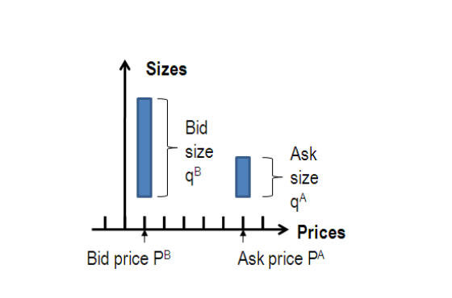

The bid price and size represent the demand for a stock, while the ask price and size represent the supply. We enumerate these observations by $n$ and compare

$$
(P^B_{n-1}, q^B_{n-1}, P^A_{n-1}, q^A_{n-1})
$$

with

$$
(P^B_n, q^B_n, P^A_n, q^A_n).
$$

Between two such observations, only one of the following events can occur:

- $P^B_n > P^B_{n-1}$ or $q^B_n > q^B_{n-1}$, signifying an increase in demand;
- $P^B_n < P^B_{n-1}$ or $q^B_n < q^B_{n-1}$, signifying a decrease in demand;
- $P^A_n < P^A_{n-1}$ or $q^A_n > q^A_{n-1}$, signifying an increase in supply;
- $P^A_n > P^A_{n-1}$ or $q^A_n < q^A_{n-1}$, signifying a decrease in supply.

We define the variable $e_n$ which measures the contribution of the $n$-th event to the size of bid and ask queues:

$$
e_n =
\mathbf{1}_{\{P^B_n \ge P^B_{n-1}\}}q^B_n
- \mathbf{1}_{\{P^B_n \le P^B_{n-1}\}}q^B_{n-1}
- \mathbf{1}_{\{P^A_n \le P^A_{n-1}\}}q^A_n
+ \mathbf{1}_{\{P^A_n \ge P^A_{n-1}\}}q^A_{n-1}.
$$

Note that if $q^B$ increases but $P^B$ remains the same, we assign $e_n=q^B_n-q^B_{n-1}$, representing the size that was added at the bid. If $q^B$ decreases, we also assign $e_n=q^B_n-q^B_{n-1}$, representing the size that was removed from the bid, whether due to a market sell or cancel buy order. If $P^B$ increases, we let $e_n=q^B_n$, representing the size of a price-improving limit order. If $P^B$ decreases, we let $e_n=q^B_{n-1}$, representing the size that was removed, whether due to a market order or a cancellation. The same classification is done for events on the ask side, with signs reversed.

Events affecting the order book occur at random times $\tau_n$, and we define

$$
N(t)=\max\{n\mid \tau_n\le t\}
$$

to be the number of events during $[0,t]$. We define the **order flow imbalance** over time intervals $[t_{k-1},t_k]$ as a sum of individual event contributions $e_n$ over these intervals:

$$
OFI_k = \sum_{n=N(t_{k-1})+1}^{N(t_k)} e_n.
$$

The order flow imbalance is a measure of supply/demand imbalance, which encompasses trades, limit orders and cancelations. Whereas previous studies [10, 20, 22, 29, 38, 43] focused on measures of "trade imbalance", using orders provides a more natural way of measuring supply and demand.[^ofi-footnote]

We also consider mid-price changes (in number of ticks) over the same time grid:

$$
\Delta P_k = \frac{P_k-P_{k-1}}{\delta},
$$

where $P_k$ is the mid-quote price at time $t_k$ and $\delta$ is the tick size (equal to 1 cent in the data).

[^ofi-footnote]: Hopman [24] computes the supply/demand imbalance based on limit orders and trades, but not cancelations.

## 2.2 A stylized model of the order book

Consider first a stylized model of the order book in which:

1. the number of shares at each price level beyond the best bid/ask is equal to $D$;
2. limit order arrivals and cancelations occur only at the best bid/ask.

Under these assumptions a linear relation holds between order flow imbalance and price changes. The paper illustrates three scenarios over an interval $[t,t+\Delta t]$.

**Market sell orders remove $M^s$ shares from the bid.**

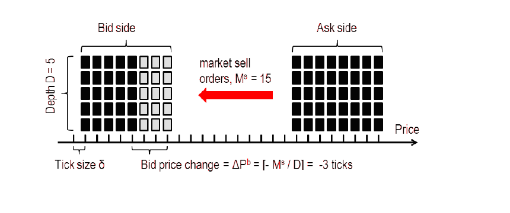

**Market sell orders remove $M^s$ shares from the bid, while limit buy orders add $L^b$ shares to the bid.**

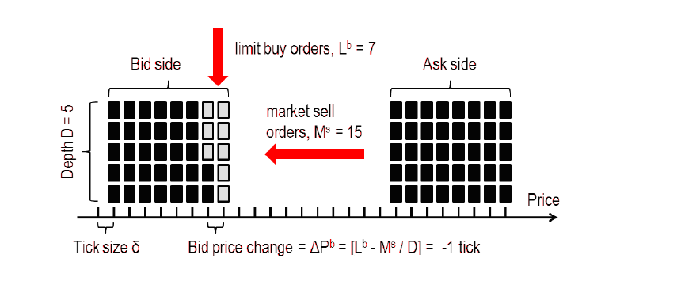

**Market sell orders and limit buy cancels remove $M^s+C^b$ shares from the bid, while limit buy orders add $L^b$ shares to the bid.**

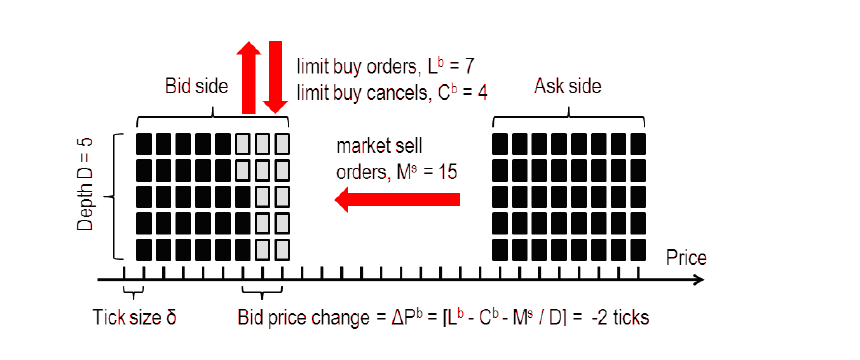

The three variables $M^b$, $C^s$ and $L^s$ for the ask can be defined analogously. Under the above assumptions, the impact of order book events at the bid (ask) side of the book is additive and only depends on their net effect on the bid (ask) queue size:

$$
\Delta P^b = \left[\frac{L^b-C^b-M^s}{D}\right],
$$

and similarly for the ask:

$$
\Delta P^a = -\left[\frac{L^s-C^s-M^b}{D}\right].
$$

These relations are remarkably simple: they involve no parameters and incorporate the effects of all order book events on bid and ask prices. Although the analysis can be carried for the bid and ask prices separately, the paper takes their average (the mid-price) to simplify the analysis:

$$
\Delta P = \frac{1}{2}\left[\frac{L^b-C^b-M^s}{D}\right]
-\frac{1}{2}\left[\frac{L^s-C^s-M^b}{D}\right].
$$

Up to truncation, this is equivalent to

$$
\Delta P = \frac{OFI}{2D}+\epsilon. \tag{1}
$$

Here

$$
OFI=L^b-C^b-M^s-L^s+C^s+M^b,
$$

and $\epsilon$ is the truncation error. This expression for $OFI$ is obtained from its definition by grouping individual order contributions $e_i$ by their types (limit buys, market sells, etc.).

## 2.3 Model specification

In reality, order books have complex dynamics and relation (1) will only hold in a statistical sense. Limit orders and cancelations occur at all levels of the order book; the distribution of depth across price levels often has humps and gaps; depth is subject to important intraday fluctuations; and hidden orders may not be reported in the data. With these considerations, the paper suggests

$$
\Delta P_k = \beta\,OFI_k+\epsilon_k, \tag{2}
$$

where $\beta$ is the **price impact coefficient** and $\epsilon_k$ is a noise term due to the influence of deeper levels of the order book and rounding errors. The preceding discussion suggests that the price impact coefficient is inversely related to market depth, which is itself subject to intraday fluctuations.

A measure of depth is defined by averaging the bid/ask queue sizes over intervals $[T_{i-1},T_i]$:

$$
AD_i =
\frac{1}{2\left(N(T_i)-N(T_{i-1})-1\right)}
\sum_{n=N(T_{i-1})+1}^{N(T_i)}
\left(q^B_n+q^A_n\right).
$$

The relation between the price impact coefficient $\beta_i$ in the interval $[T_{i-1},T_i]$ and market depth is specified as

$$
\beta_i = \frac{c}{AD_i^\lambda}+\nu_i, \tag{3}
$$

where $c$ and $\lambda$ are constants and $\nu_i$ is a noise term. The stylized model above corresponds to $\lambda=1$.

The specification (2)-(3) may be regarded as a model of instantaneous price impact over a short time interval $[t_{k-1},t_k]$. An order submitted at $\tau\in[t_{k-1},t_k]$ has a contribution $e_\tau$ and joins the aggregate order flow imbalance $OFI_k$. If the order goes in the same direction as the majority of the orders, $\operatorname{sgn}(e_\tau)=\operatorname{sgn}(OFI_k)$, it reinforces the concurrent order flow imbalance and can affect the price. If the order goes against the concurrent order flow imbalance, it is compensated by other orders and may have an instantaneous impact of zero. In the model all events (including trades) have a linear price impact, equal to $\beta$ on average. Their realized impact, however, depends on the rest of the orders that arrive during the same time interval.

The idea that concurrent limit order activity can make a difference in terms of trades' impact was demonstrated by Stephens et al. [41]. The approach can also be related to Bouchaud et al. [12], where order book events have linear impact on prices depending on their signs and types. The major difference lies in aggregation across time and events. Order book events have complicated auto- and cross-correlation structures on the timescale of individual events, which typically vanish after 10 seconds. In the data, autocorrelations at a 10-second timescale are small and quickly vanish as well.

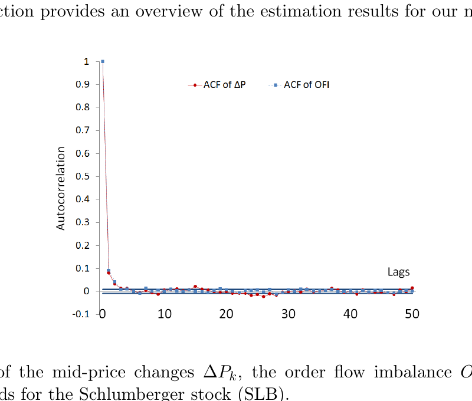

**Figure 1.** ACF of the mid-price changes $\Delta P_k$, the order flow imbalance $OFI_k$ and the 5% significance bounds for the Schlumberger stock (SLB).

The linear equation (2) is different from models of price impact that consider only the size of trades [18, 20, 29, 43, 38, 39]. Instead of modeling price impact of trades as a nonlinear function of trade size, the paper models the price impact of all events (including trades) as a linear function of their size after events are aggregated into a single imbalance variable. Section 4 argues that the effect of trades on prices is adequately captured by order flow imbalance and that, if one leaves out all events except trades, relation (2) leads to an apparent concave relation between price changes and trade volume.

# 3 Estimation and results

## 3.1 The trades and quotes (TAQ) data

The data set consists of one calendar month (April 2010) of trades and quotes (TAQ) data for 50 stocks. The stocks were selected by a random number generator from the S&P 500 constituents. The S&P 500 composition for that month was obtained from Compustat and the data for individual stocks was obtained from the TAQ consolidated quotes and TAQ consolidated trades databases through Wharton Research Data Services (WRDS).

Consolidated quotes contains all changes in queue sizes at the best bid and ask. For each stock, a data update consists of a timestamp (rounded to the nearest second), bid price, bid size, ask price, ask size and exchange flag. Consolidated trades (or market orders) consist of a timestamp, a price and a size. These two data sets are often referred to as Level 1 data, as opposed to Level 2 data, which also includes quote updates deeper in the book.

The authors use TAQ data rather than Level 2 order book data because it is more accessible, yet contains all events in the top order book (best bid and ask updates). The ratio of the number of quote updates to the number of trades is roughly 40 to 1 in the data, suggesting that quotes may convey substantially more information than trades alone.

Using the procedure described in the Appendix, all quote updates are aggregated to estimate the National Best Bid and Offer sizes and prices (NBBO) at each quote update. Focusing on one exchange at a time yields similar results.

A uniform grid in time $\{t_0,\ldots,t_N\}$ with

$$
t_k-t_{k-1}\equiv \Delta t=10\text{ seconds}
$$

is used to compute price changes and order flow imbalances. To test robustness to the basic timescale, calculations were repeated on a subsample of stocks for values of $\Delta t$ ranging from 10 quote updates (usually less than half a second) up to 10 minutes. The model fit generally increases with $\Delta t$, while the rest of the results remains the same. Time aggregation alleviates data discreteness and mitigates errors due to the trade-matching algorithm.

### Table 1 - Descriptive statistics

The full table is available in [`tables.md`](tables.md#table-1---descriptive-statistics) and [`tables/table-01-descriptive-statistics.csv`](tables/table-01-descriptive-statistics.csv).

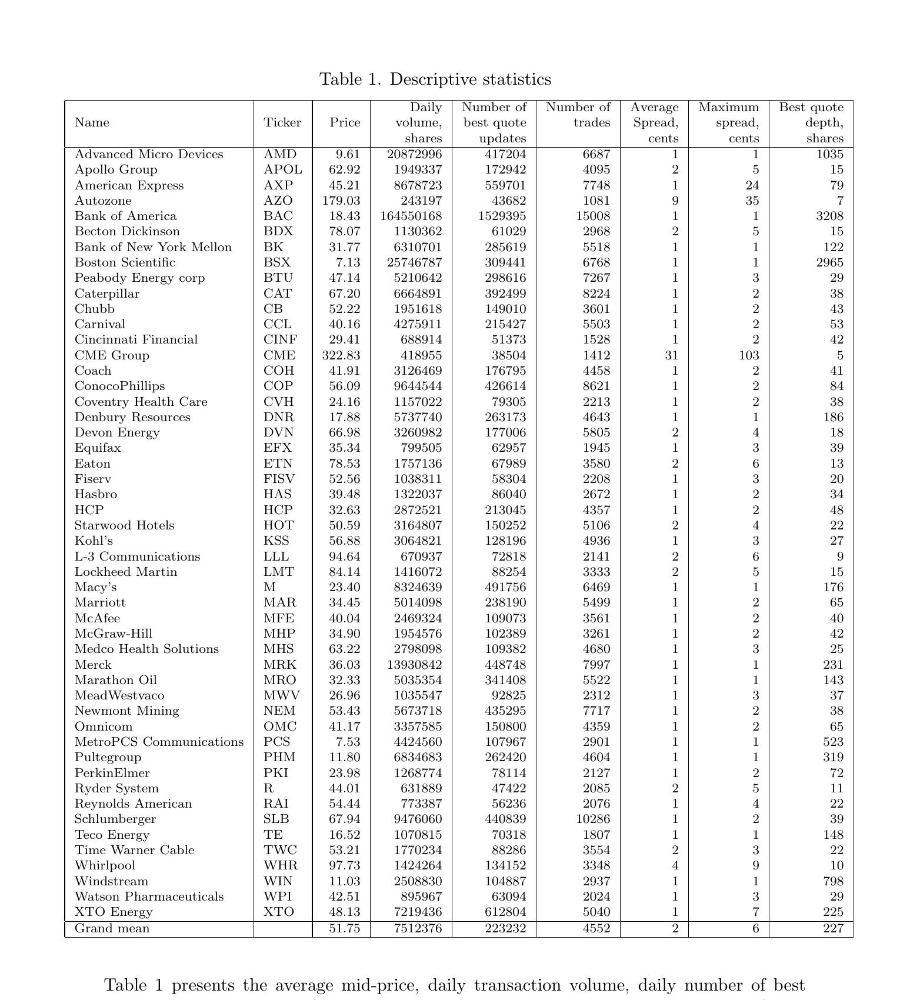

Table 1 presents the average mid-price, daily transaction volume, daily number of best quote updates, daily number of trades, spread and depth at the best bid and ask for 50 randomly chosen U.S. stocks. All values are calculated from the filtered data, consisting of 21 trading days during April 2010.

## 3.2 Empirical findings

The price impact coefficient $\beta$ is assumed constant over each half-hour interval $[T_i,T_{i+1}]$ and model (2) is estimated by ordinary least squares in each half-hour subsample for each stock:

$$
\Delta P_k=\hat\alpha_i+\hat\beta_i OFI_k+\hat\epsilon_k. \tag{4}
$$

Figure 2 presents a scatter plot of $\Delta P_k$ against $OFI_k$ for one half-hour subsample. Table 2 reports regression outputs averaged across time for each stock. The table provides strong evidence of a linear relation between order flow imbalance and price changes. The goodness of fit is high across stocks; $\hat\beta_i$ is virtually always statistically significant at the 95% level, while the intercept is mostly insignificant. Because $OFI_k$ includes the contribution of price-changing order book events, the authors note a possible tautology in regression (4). As a check, they re-estimate (4) for a subsample after excluding price-changing events from $OFI_k$; $R^2$ declines but remains in the 35%-60% range.

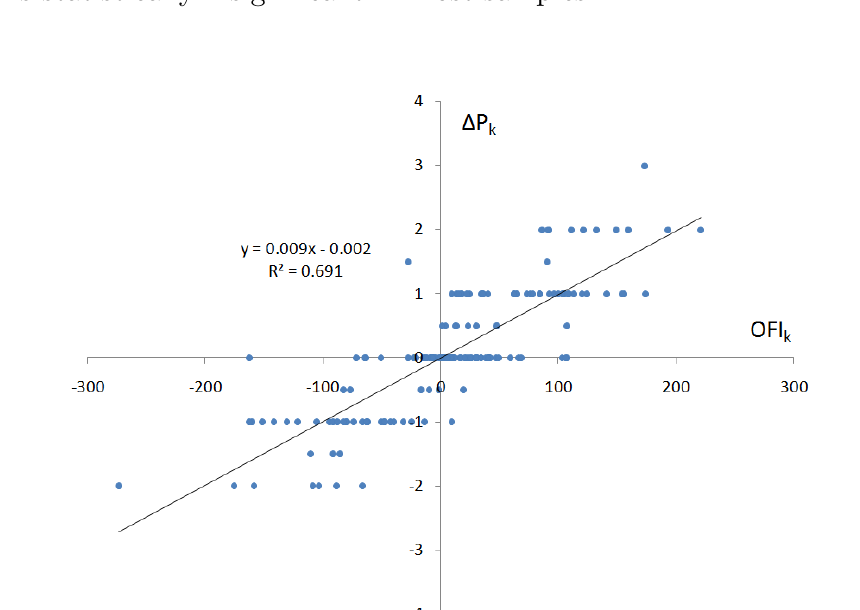

**Figure 2.** Scatter plot of $\Delta P_k$ against $OFI_k$ for Schlumberger (SLB), 04/01/2010, 11:30-12:00pm.

The residuals are heteroscedastic, so White's heteroscedasticity-consistent standard errors are used for the z-test. To check for higher-order/nonlinear dependence the paper adds a quadratic term,

$$
\hat\gamma_{Q,i} OFI_k|OFI_k|,
$$

to the regression. The average $R^2$ increases only from 65% to 68%, and $\hat\gamma_{Q,i}$ is statistically insignificant in most samples.

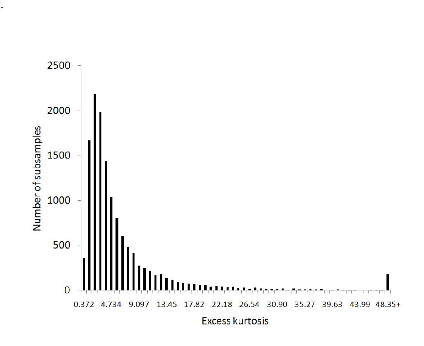

**Figure 3.** Distribution of excess kurtosis of the residuals $\hat\epsilon_k$ across stocks and time.

### Table 2 - Relation between price changes and order flow imbalance

The full table is available in [`tables.md`](tables.md#table-2---relation-between-price-changes-and-order-flow-imbalance) and [`tables/table-02-price-change-vs-ofi.csv`](tables/table-02-price-change-vs-ofi.csv). Across the 50 stocks, the reported average $R^2$ is 65%, the average t-statistic for $\hat\beta$ is 11.47, and $\hat\beta$ is statistically significant in 97% of half-hour subsamples.

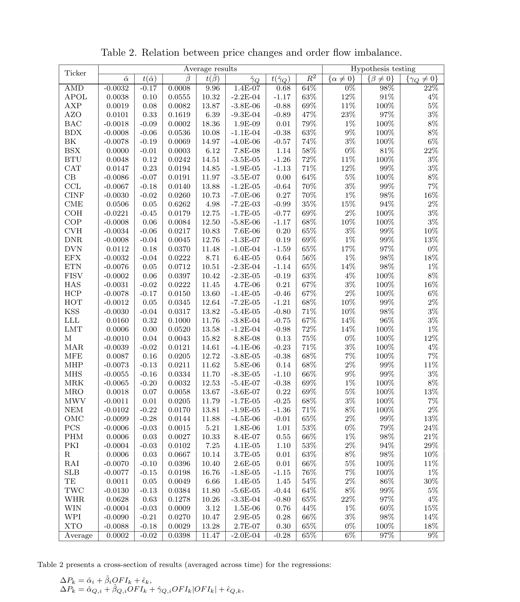

The authors then estimate the parameters $\lambda$ and $c$ in (3). For each stock, $\hat\lambda$ is first obtained via the log-linear regression

$$
\log \hat\beta_i
=\hat\alpha_{L,i}-\hat\lambda\log AD_i+\hat\epsilon_{L,i}. \tag{5}
$$

Using $\hat\lambda$, $c$ is estimated in

$$
\hat\beta_i
=\hat\alpha_{M,i}+\frac{\hat c}{AD_i^{\hat\lambda}}+\hat\epsilon_{M,i}. \tag{6}
$$

Both regressions are estimated using ordinary least squares. The quality of the fits demonstrates that instantaneous price impact is inversely related to market depth. Three stocks (APOL, AZO and CME) have poor fits and also have wide spreads and low depth. Hidden orders or depth beyond the best price levels may be more important for these stocks.

Since the residuals appear autocorrelated, t-statistics and confidence intervals are computed with Newey-West standard errors. Estimates of $\hat\lambda$ are close to 1 across stocks and the hypothesis $\lambda=1$ cannot be rejected for 35 of 50 stocks. The restricted model with $\lambda=1$ also fits well. The constant $\hat c$ generally differs from the stylized-model value $c=1/2$; lower values of $\hat c$ imply that mid-prices are, on average, more resilient to incoming orders than suggested by the simple average-depth measure.

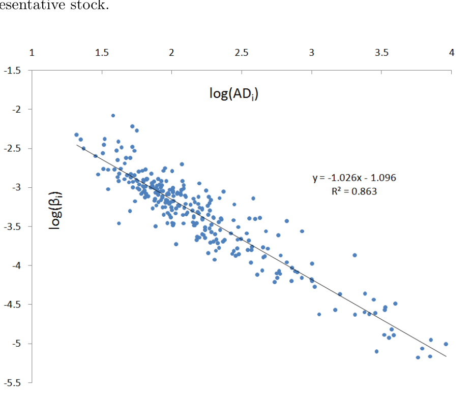

**Figure 4.** Log-log scatter plot of the price impact coefficient estimate $\hat\beta_i$ against average market depth $AD_i$ for Schlumberger (SLB).

### Table 3 - Relation between the price impact coefficient and market depth

The full table is available in [`tables.md`](tables.md#table-3---relation-between-the-price-impact-coefficient-and-market-depth) and [`tables/table-03-impact-coefficient-vs-depth.csv`](tables/table-03-impact-coefficient-vs-depth.csv). The grand mean reported in the paper is $\hat\lambda=0.98$, with a mean $R^2$ of 74% for the log-linear regression.

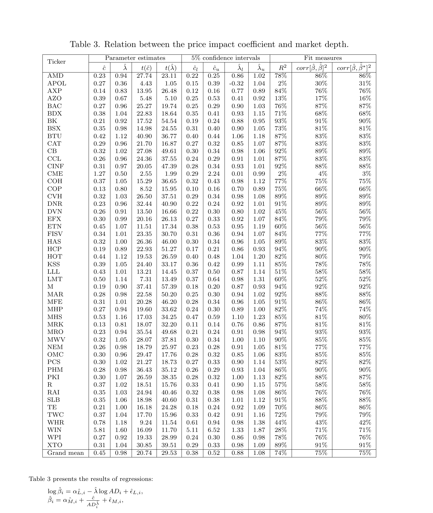

## 3.3 Intraday patterns

The link between price impact and market depth has an important implication. Since market depth follows a predictable pattern of intraday seasonality, the price impact coefficient must also have a predictable intraday pattern. The authors average $\hat\beta_i$ for each stock and half-hour interval across days, normalize by the average $\hat\beta_i$ for that stock, and then average normalized seasonality patterns across stocks. The same procedure is repeated for $AD_i$.

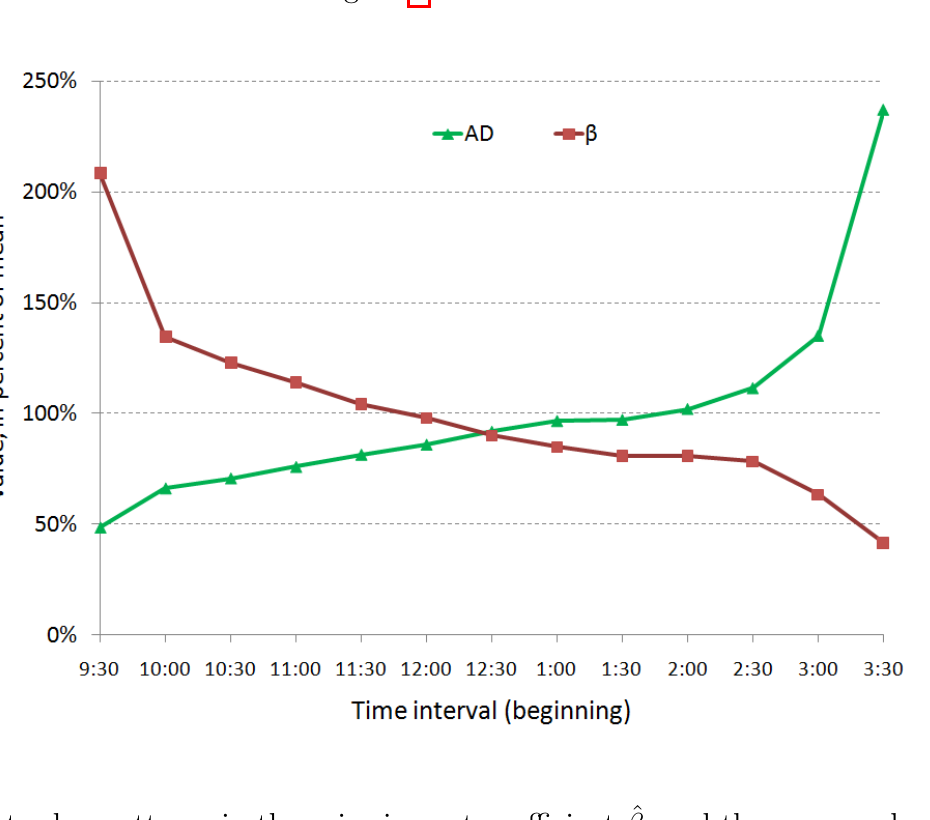

**Figure 5.** Intraday patterns in the price impact coefficient $\hat\beta_i$ and the average depth $AD_i$.

Near the market open, depth is two times lower than it is on average, indicating a relatively shallow order book. In a shallow market, incoming orders can more easily affect the mid-price and the price impact coefficient is about two times higher near the open than on average. Moreover, price impact is about five times higher at the market open than at the market close.

The intraday pattern in price impact can be used to explain the intraday patterns in price volatility. Taking the variance of both sides of (2) yields

$$
\operatorname{var}[\Delta P_k]_i
=\beta_i^2\operatorname{var}[OFI_k]_i
+\operatorname{var}[\epsilon_k]_i. \tag{7}
$$

The price volatility has a sharp peak near the market open, while the volatility of order flow imbalance peaks near the market close. The latter peak is offset by low price impact, which gradually declines through the day. For the $i$-th half-hour interval, (7) implies approximately

$$
\operatorname{var}[\Delta P_k]_i
\approx \hat\beta_i^2\operatorname{var}[OFI_k]_i.
$$

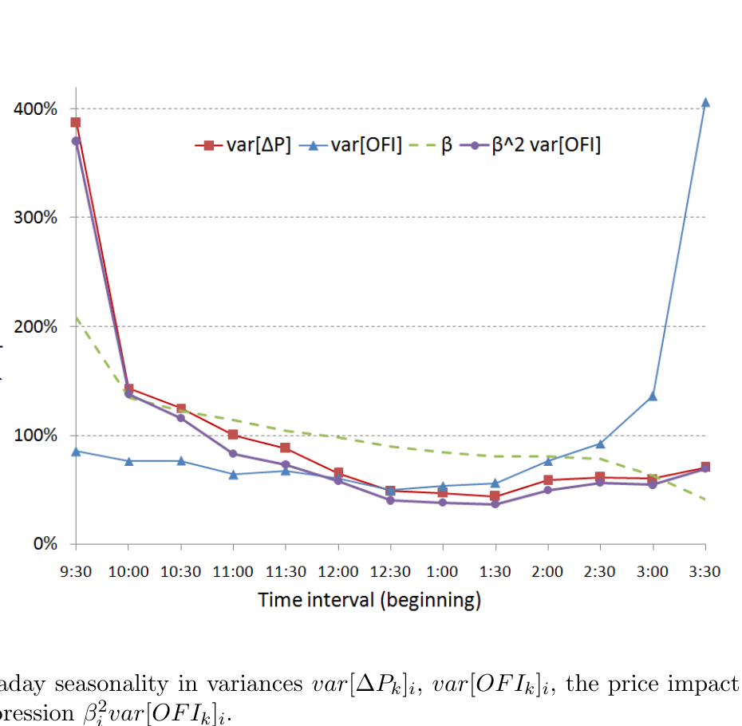

**Figure 6.** Intraday seasonality in $\operatorname{var}[\Delta P_k]_i$, $\operatorname{var}[OFI_k]_i$, the price impact coefficient $\hat\beta_i$ and $\hat\beta_i^2\operatorname{var}[OFI_k]_i$.

The paper contrasts this explanation with structural interpretations based on unobservable information parameters. Madhavan et al. [33] argue that volatility is higher in the morning because of a higher inflow of public and private information, while Hasbrouck [21] argues that the peak at the open is mostly due to higher intensity of public information. Both agree that the impact of trades is larger in the morning. The OFI model explains the peak using observable quantities. If limit-order traders perceive information asymmetry in the morning, they may lower submitted depth to avoid being "picked off"; low depth then implies higher price impact.

# 4 Price impact of trades

## 4.1 Trade imbalance vs order flow imbalance

The previous section establishes a linear relation between price changes and $OFI_k$. This section compares order flow imbalance with trade imbalance, which is widely used in the literature and in practice, and shows how the nonlinear price impact of trade volume may be derived from the linear OFI model.

A **buy trade** is a transaction initiated by a market buy order and a **sell trade** is a transaction initiated by a market sell order. The trade imbalance during $[t_{k-1},t_k]$ is defined as

$$
TI_k =
\sum_{n=N(t_{k-1})+1}^{N(t_k)} b_n
-
\sum_{n=N(t_{k-1})+1}^{N(t_k)} s_n,
$$

where $b_n$ is the size of a buyer-initiated trade at the $n$-th quote (or zero if no buy trade occurs there) and $s_n$ is the corresponding sell-trade size. The procedure that matches trades with quotes and classifies them as buys or sells is described in the Appendix.

To compare explanatory power, the paper estimates

$$
\Delta P_k=\hat\alpha_i+\hat\beta_i OFI_k+\hat\epsilon_k, \tag{8a}
$$

$$
\Delta P_k=\hat\alpha_{T,i}+\hat\beta_{T,i}TI_k+\hat\epsilon_{T,k}, \tag{8b}
$$

and

$$
\Delta P_k=\hat\alpha_{D,i}
+\hat\theta_{O,i}OFI_k
+\hat\theta_{T,i}TI_k
+\hat\epsilon_{D,k}. \tag{8c}
$$

The regressions are estimated separately for every half-hour subsample. If the effect of trades is already included in order flow imbalance, the coefficients $\hat\theta_{T,i}$ in (8c) should be indistinguishable from zero. Only linear terms are used because the authors find no evidence of nonlinear price impact for either $OFI_k$ or $TI_k$ in these regressions.

When taken individually, both $OFI_k$ and $TI_k$ have statistically significant influence on price changes, but $OFI_k$ explains substantially more: the average $R^2$ is 65% for order flow imbalance versus 32% for trade imbalance. When both variables are used together, the average t-statistic of $TI_k$ falls by a factor of four and $\hat\theta_{T,i}$ is statistically significant in only 31% of subsamples, while the dependence on $OFI_k$ remains strong.

The paper summarizes the findings as:

1. order flow imbalance $OFI_k$ explains price movements better than the imbalance of trades;
2. the effect of trade imbalance is adequately included in $OFI_k$, a more general measure of supply/demand imbalance.

### Table 4 - Comparison of order flow imbalance and trade imbalance

Panel A (mid-prices): [`tables/table-04a-ofi-vs-trade-imbalance-midprices.csv`](tables/table-04a-ofi-vs-trade-imbalance-midprices.csv)  
Panel B (transaction prices): [`tables/table-04b-ofi-vs-trade-imbalance-transaction-prices.csv`](tables/table-04b-ofi-vs-trade-imbalance-transaction-prices.csv)  
Both are rendered in [`tables.md`](tables.md#table-4a---comparison-of-order-flow-imbalance-and-trade-imbalance-mid-prices).

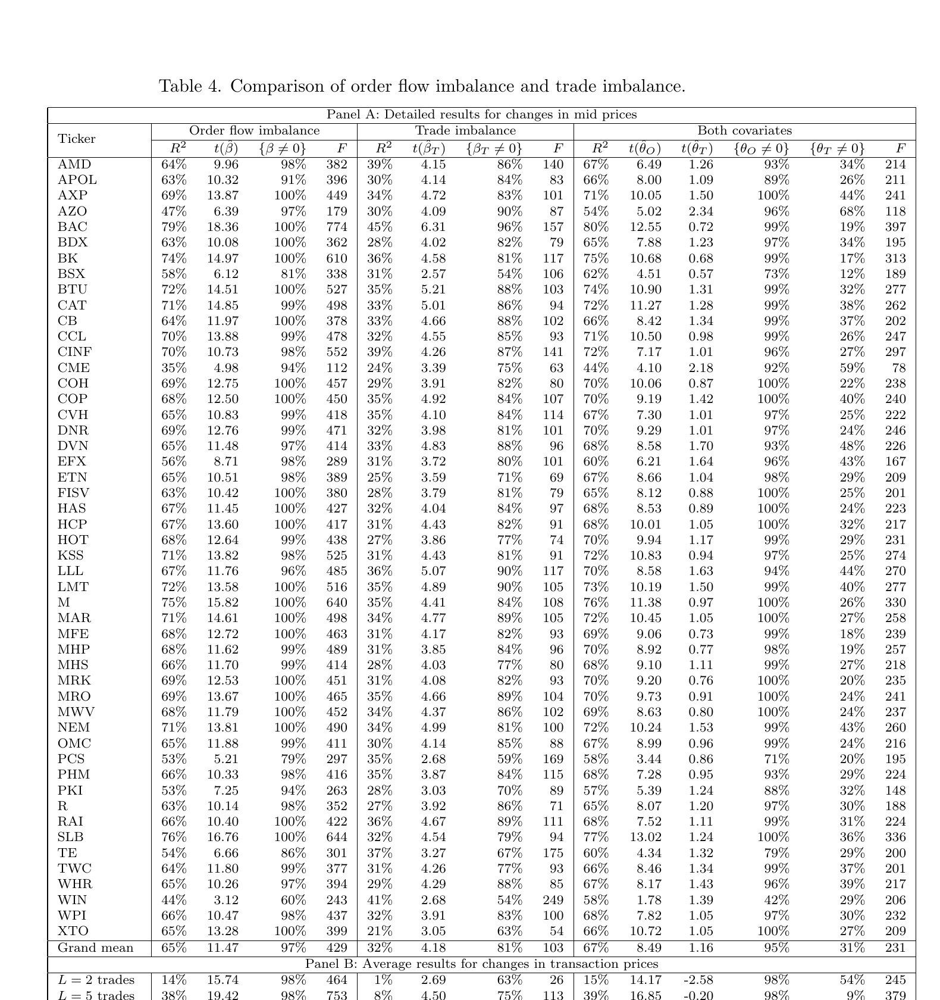

As a robustness check, the regressions are repeated using changes between transaction prices $P_k^t$ instead of mid-prices. Price differences in trade time are

$$
\Delta_L P_k^t=P_k^t-P_{k-L}^t.
$$

For randomly selected stocks and $L=2,5,10$ trades, the findings are essentially the same: $OFI_k$ explains price changes better than $TI_k$, and trade imbalance becomes statistically insignificant when used together with $OFI_k$; the increase in $R^2$ from adding $TI_k$ is not economically significant.

The relation between transaction-price changes and OFI is concave in some samples. Quadratic terms $OFI_k|OFI_k|$ (and respectively $TI_k|TI_k|$) are significant in nearly half of the samples. Sampling at special times (trade times), or using trade prices, may introduce biases. The paper therefore treats this evidence of nonlinearity cautiously.

## 4.2 Does volume move the prices?

The relation between price changes and volume is empirically well documented, and traded volume is an important metric for execution algorithms. However, it remains unclear whether traded volume truly determines the magnitude of price moves or is a good metric for price impact. The paper extends earlier evidence in two ways: it shows that an apparent concave dependence on traded volume can emerge from aggregation even when prices are driven by order flow imbalance, and it empirically shows that the price-volume relation becomes statistically insignificant after accounting for OFI.

The volume traded during $[t_{k-1},t_k]$ is

$$
VOL_k=
\sum_{n=N(t_{k-1})+1}^{N(t_k)} b_n
+
\sum_{n=N(t_{k-1})+1}^{N(t_k)} s_n
=
\sum_{n=N(t_{k-1})+1}^{N(t_k)} w_n,
$$

where $w_n=b_n+s_n$ is the size of any trade (buy or sell) if it occurs at the $n$-th quote, or zero otherwise. Both $VOL_k$ and $OFI_k$ are sums of random variables, so for large aggregation windows their behavior can be related using the Law of Large Numbers and the Central Limit Theorem.

### Proposition 1

Consider an interval $[0,T)$ and let $N(T)$ be the number of order book events, $OFI(T)$ the order flow imbalance and $VOL(T)$ the traded volume. Assume:

1. order book events accumulate over time at average rate $\Lambda$:
   $$
   \frac{N(T)}{T}\to\Lambda,\qquad T\to\infty;
   $$
2. $\{e_i\}_{i=1}^{\infty}$ are i.i.d. random variables with finite variance $\sigma^2$;
3. $\{w_i\}_{i=1}^{\infty}$ are i.i.d. random variables with finite mean $\mu\pi$, where $\pi$ is the proportion of order book events corresponding to trades and $\mu$ is the mean trade size.

Then

$$
\frac{\sqrt{\mu\pi}}{\sigma}
\frac{OFI(T)}{\sqrt{VOL(T)}}
\Rightarrow \xi,
\qquad T\to\infty, \tag{9}
$$

where $\xi\sim N(0,1)$ and $\Rightarrow$ denotes convergence in distribution.

First, applying the law of large numbers to traded volume gives

$$
\frac{VOL(T)}{N(T)}
=
\frac{\sum_{i=1}^{N(T)}w_i}{N(T)}
\to \mu\pi,
\quad \text{w.p.1},\quad T\to\infty. \tag{10}
$$

Second, event contributions $e_i$ have finite variance and, under the assumptions, the classical central limit theorem gives

$$
\frac{OFI(T)}{\sigma\sqrt{N(T)}}
\equiv
\frac{\sum_{i=1}^{N(T)}e_i}{\sigma\sqrt{N(T)}}
\Rightarrow \xi,
\quad T\to\infty. \tag{11}
$$

Although the denominator $\sigma\sqrt{N(T)}$ is random, it diverges by assumption 1 and Anscombe's lemma permits this normalization in the central limit theorem. Since the square-root function is continuous, the convergence in (10) is almost sure, and its limit is deterministic, (10) and (11) may be combined:

$$
\frac{\sqrt{\mu\pi}}{\sigma}
\frac{OFI(T)}{\sqrt{VOL(T)}}
\Rightarrow \xi. \tag{12}
$$

If $[0,T)$ contains a sufficiently large number of order book events and trades, the limit argument implies the noisy scaling relation

$$
OFI(T)=\xi\frac{\sigma}{\sqrt{\mu\pi}}\sqrt{VOL(T)}. \tag{13}
$$

If this holds for every sufficiently long interval $[t_{k-1},t_k)$, substitution into (2) yields

$$
\Delta P_k=\theta_k\sqrt{VOL_k}+\epsilon_k, \tag{14}
$$

with

$$
\theta_k=\beta_i\xi_k\frac{\sigma}{\sqrt{\mu\pi}},
\qquad \xi_k\sim N(0,1).
$$

Hence

$$
\theta_k\sim N\!\left(0,\beta_i^2\frac{\sigma^2}{\mu\pi}\right).
$$

The slope is therefore random from interval to interval, which makes the volume model considerably less robust than (2). Even when prices are driven entirely by order flow imbalance, a noisy square-root relation between price changes and traded volume appears.

If the assumptions of Proposition 1 do not hold, the price-volume relation may have a different exponent. A variety of exponents $0<H<1$ have been observed empirically, motivating

$$
\Delta P_k=\theta_k VOL_k^H+\epsilon_k. \tag{15}
$$

To estimate $H$, the paper sets $\epsilon_k=0$ and $\theta_k=\bar\theta_i\xi_k$ and fits

$$
\log|\Delta P_k^t|
=
\log\hat{\bar\theta}_i
+\hat H_i\log VOL_k
+\log\hat\xi_k. \tag{16}
$$

The following regressions are then compared:

$$
|\Delta P_k|
=\hat\alpha_{O,i}+\hat\beta_{O,i}|OFI_k|+\hat\epsilon_{O,k}, \tag{17a}
$$

$$
|\Delta P_k|
=\hat\alpha_{V,i}+\hat\beta_{V,i}VOL_k^{\hat H_i}+\hat\epsilon_{V,k}, \tag{17b}
$$

$$
|\Delta P_k|
=\hat\alpha_{W,i}
+\hat\phi_{O,i}|OFI_k|
+\hat\phi_{V,i}VOL_k^{\hat H_i}
+\hat\epsilon_{W,k}. \tag{17c}
$$

The estimated exponent varies considerably across stocks and time and is generally below $1/2$ in the data. $|OFI_k|$ explains the magnitude of price moves better than $VOL_k^{\hat H_i}$. Although both variables are significant when taken individually, only $|OFI_k|$ remains significant in the multiple regression. Thus, the dependence between the magnitude of price moves and traded volume is mostly attributed to correlation between $VOL_k$ and $|OFI_k|$. The number of trades is also statistically significant on a stand-alone basis but becomes insignificant when added to (17c).

### Table 5 - Comparison of traded volume and order flow imbalance

The full table is available in [`tables.md`](tables.md#table-5---comparison-of-traded-volume-and-order-flow-imbalance) and [`tables/table-05-volume-vs-ofi.csv`](tables/table-05-volume-vs-ofi.csv). The grand mean $R^2$ is 58% for $|OFI_k|$ alone versus 23% for the volume specification; with both covariates the grand mean $R^2$ is 61%.

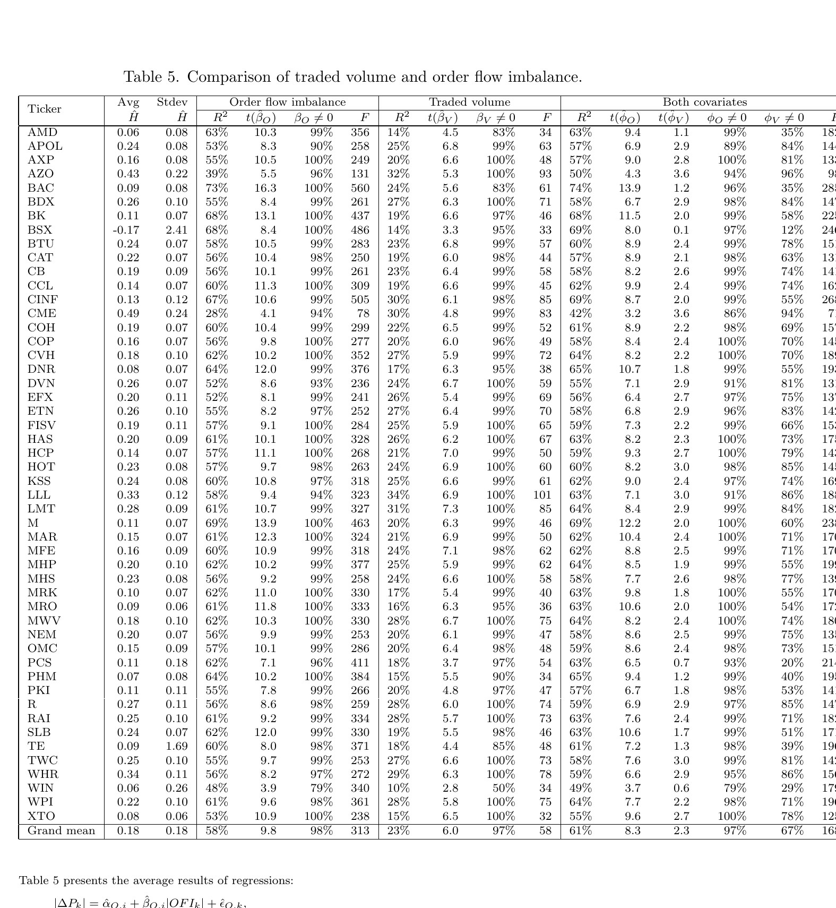

# 5 Conclusion

The paper introduces order flow imbalance, a variable that cumulates the sizes of order book events while treating the contributions of market, limit and cancel orders equally, and provides empirical and theoretical evidence for a linear relation between high-frequency price changes and order flow imbalance for individual stocks. The linear model is robust across stocks and its impact coefficient is inversely proportional to market depth. These relations suggest that prices respond to changes in supply and demand for shares at the best quotes, and that the impact coefficient fluctuates with the amount of liquidity provision, or depth, in the market.

Order flow imbalance is shown to be a stronger driver of high-frequency price changes than standard measures of trade imbalance. Trades appear to carry little to no information about price changes after simultaneous order flow imbalance is taken into account. If trades do not help explain price changes after controlling for OFI, the relation between price changes and traded volume may simply capture the noisy scaling relation between these variables.

Overall, the findings give an intuitive picture of the price impact of order book events that is simpler than the one conveyed by many previous studies.

# References

1. H. Ahn, K. Bae, and K. Chan, *Limit orders, depth, and volatility: evidence from the stock exchange of Hong Kong*, Journal of Finance, 56 (2001), pp. 767-788.
2. R. Almgren and N. Chriss, *Optimal execution of portfolio transactions*, Journal of Risk, 3 (2000), pp. 5-39.
3. R. Almgren, C. Thum, E. Hauptmann, and H. Li, *Direct estimation of equity market impact*, Journal of Risk, 18 (2005), p. 57.
4. T. Andersen and T. Bollerslev, *Deutsche mark - dollar volatility: intraday activity patterns, macroeconomic announcements, and longer run dependencies*, Journal of Finance, 53 (1998), p. 219.
5. M. Avellaneda, S. Stoikov, and J. Reed, *Forecasting prices from level-I quotes in the presence of hidden liquidity*. Working paper, 2010.
6. D. Bertsimas and A. Lo, *Optimal control of execution costs*, Journal of Financial Markets, 1 (1998), pp. 1-50.
7. J.-P. Bouchaud, *Encyclopedia of Quantitative Finance*, Wiley, 2010, ch. Price Impact.
8. J.-P. Bouchaud, D. Farmer, and F. Lillo, *Handbook of financial markets: dynamics and evolution*, Elsevier: Academic Press, 2009, ch. How markets slowly digest changes in supply and demand.
9. J.-P. Bouchaud, Y. Gefen, M. Potters, and M. Wyart, *Fluctuations and response in financial markets: the subtle nature of 'random' price changes*, Quantitative Finance, 4 (2004), p. 176.
10. T. Chordia, R. Roll, and A. Subrahmanyam, *Liquidity and market efficiency*, Journal of Financial Economics, 87 (2008), p. 249.
11. P. K. Clark, *A subordinated stochastic process model with finite variance for speculative price*, Econometrica, 41 (1973), pp. 135-155.
12. Z. Eisler, J.-P. Bouchaud, and J. Kockelkoren, *The price impact of order book events: market orders, limit orders and cancellations*, Quantitative Finance Papers 0904.0900, arXiv.org, Apr. 2009.
13. P. Embrechts, C. Kluppelberg, and T. Mikosch, *Modelling extremal events for insurance and finance*, Springer, 1997.
14. R. Engle, R. Ferstenberg, and J. Russel, *Measuring and modeling execution cost and risk*. NYU Working Paper No. FIN-06-044, 2006.
15. R. Engle and A. Lunde, *Trades and quotes: a bivariate point process*, Journal of Financial Econometrics, 1 (2003), pp. 159-188.
16. M. Evans and R. Lyons, *Order flow and exchange rate dynamics*, Journal of Political Economy, 110 (2002), p. 170.
17. J. D. Farmer, L. Gillemot, F. Lillo, S. Mike, and A. Sen, *What really causes large price changes?*, Quantitative Finance, 4 (2004), pp. 383-397.
18. X. Gabaix, P. Gopikrishnan, V. Plerou, and H. Stanley, *A theory of power-law distributions in financial market fluctuations*, Nature, 423 (2003), p. 267.
19. J. Gatheral, *No-dynamic-arbitrage and market impact*, Quantitative Finance, 10 (2010), p. 749.
20. J. Hasbrouck, *Measuring the information content of stock trades*, Journal of Finance, 46 (1991), pp. 179-207.
21. J. Hasbrouck, *The summary informativeness of stock trades: An econometric analysis*, Review of Financial Studies, 4 (1991), p. 571.
22. J. Hasbrouck and D. Seppi, *Common factors in prices, order flows and liquidity*, Journal of Finance and Economics, 59 (2001), p. 383.
23. N. Hautsch and R. Huang, *The market impact of a limit order*. SFB 649 Discussion Papers, 2009.
24. C. Hopman, *Do supply and demand drive stock prices?*, Quantitative Finance, 7 (2007), pp. 37-53.
25. G. Huberman and W. Stanzl, *Price manipulation and quasi-arbitrage*, Econometrica, 72 (2004), pp. 1247-1275.
26. C. Jones, G. Kaul, and M. Lipson, *Transactions, volume, and volatility*, Review of Financial Studies, 7 (1994), pp. 631-651.
27. J. Karpoff, *The relation between price changes and trading volume: A survey*, Journal of Financial and Quantitative Analysis, 22 (1987), p. 109.
28. D. Keim and A. Madhavan, *The upstairs market for large-block transactions: Analysis and measurement of price effects*, Review of Economic Studies, 9 (1996), p. 1.
29. A. Kempf and O. Korn, *Market depth and order size*, Journal of Financial Markets, 2 (1999), p. 29.
30. P. Knez and M. Ready, *Estimating the profits from trading strategies*, Review of Financial Studies, 9 (1996), p. 1121.
31. C. Lee, B. Mucklow, and M. Ready, *Spreads, depths, and the impact of earnings information: an intraday analysis*, Review of Financial Studies, 6 (1993), pp. 345-374.
32. C. Lee and M. Ready, *Inferring trade direction from intraday data*, Journal of Finance, 46 (1991), pp. 733-746.
33. A. Madhavan, M. Richardson, and M. Roomans, *Why do security prices change? a transaction-level analysis of NYSE stocks*, Review of Financial Studies, 10 (1997), p. 1035.
34. T. McInish and R. Wood, *An analysis of intraday patterns in bid/ask spreads for NYSE stocks*, Journal of Finance, 47 (1992), pp. 753-764.
35. A. Obizhaeva and J. Wang, *Optimal trading strategy and supply/demand dynamics*. NBER Working Papers, No. 11444, 2005.
36. E. Odders-White, *On the occurrence and consequences of inaccurate trade classification*, Journal of Financial Markets, 3 (2000), pp. 259-286.
37. M. O'Hara, *Market Microstructure Theory*, Wiley, 1998.
38. V. Plerou, P. Gopikrishnan, X. Gabaix, and H. Stanley, *Quantifying stock-price response to demand fluctuations*, Physical Review E, 66 (2002), p. 027104.
39. M. Potters and J. Bouchaud, *More statistical properties of order books and price impact*, Physica A, 324 (2003), pp. 133-140.
40. G. Richardson, S. E. Sefcik, and R. Thompson, *A test of dividend irrelevance using volume reaction to a change in dividend policy*, Journal of Financial Economics, 17 (1986), pp. 313-333.
41. C. Stephens, H. Waelbroeck, and A. Mendoza, *Relating market impact to aggregate order flow: the role of supply and demand in explaining concavity and order flow dynamics*. Working Paper Series, 2009.
42. E. Theissen, *A test of the accuracy of the Lee/Ready trade classification algorithm*, Journal of International Financial Markets, Institutions and Money, 11 (2001), pp. 147-165.
43. N. Torre and M. Ferrari, *The Market Impact Model*, BARRA, 1997.
44. P. Weber and B. Rosenow, *Order book approach to price impact*, Quantitative Finance, 5 (2005), pp. 357-364.
45. P. Weber and B. Rosenow, *Large stock price changes: volume or liquidity?*, Quantitative Finance, 6 (2006), p. 7.
46. I. Zovko and J. D. Farmer, *The power of patience: A behavioral regularity in limit order placement*, Quantitative Finance, 2 (2002), pp. 387-392.

# Appendix: TAQ data processing

Quotes data were filtered as follows:

1. Timestamp $\in$ [9:30 am, 4:00 pm].
2. Bid, ask, bid size and ask size are positive.
3. Quote mode $\notin\{4,7,9,11,13,14,15,19,20,27,28\}$.

Trades data were filtered as follows:

1. Timestamp $\in$ [9:30 am, 4:00 pm].
2. Price and size are positive.
3. Correction indicator $\le 2$.
4. Condition $\notin\{\text{"O"},\text{"Z"},\text{"B"},\text{"T"},\text{"L"},\text{"G"},\text{"W"},\text{"J"},\text{"K"}\}$.

From the filtered quotes data the authors construct National Best Bid and Offer (NBBO) quotes by scanning the filtered quotes data while maintaining a matrix with the best quotes for every exchange. When a new entry is read, the exchange flag identifies the row to update. The NBBO prices are computed at each entry as the highest bid and lowest ask across all exchanges. NBBO sizes are the sums of all sizes at the NBBO bid and ask across all exchanges.

After NBBO quotes are computed, a simple quote test is applied to NBBO quotes and filtered trades data. A trade is matched with a quote if:

1. the trade is not inside the spread:
   - trade price $\ge$ NBBO ask: the trade is considered a **buy trade**;
   - trade price $\le$ NBBO bid: the trade is considered a **sell trade**;
2. trade date = quote date;
3. trade timestamp $\in$ [quote timestamp, quote timestamp + 1 second];
4. if several quotes satisfy the conditions, the trade is matched with the earliest quote.

Other routines to estimate trade direction include the tick test and the Lee-Ready rule [32]. The paper notes that there is no compelling evidence that either heuristic is superior [36, 42]. Applying the tick test instead of the quote test on a subsample produces virtually the same results.

Finally, observations with extremely high bid-ask spreads are removed. For each stock, the 95th percentile of its bid-ask spread distribution is computed and the 5% of that stock's quotes above this percentile are removed.
