# Appendix: Proofs of the results

This file preserves the proof appendix in fixed-width text extracted directly from the PDF, with a rendered image of every source page beside it. The main paper's key equations are normalized to LaTeX in `document.md` and `equations.md`; the dense proof algebra is intentionally kept close to the source layout here to avoid silently altering intermediate expressions.


## PDF page 25

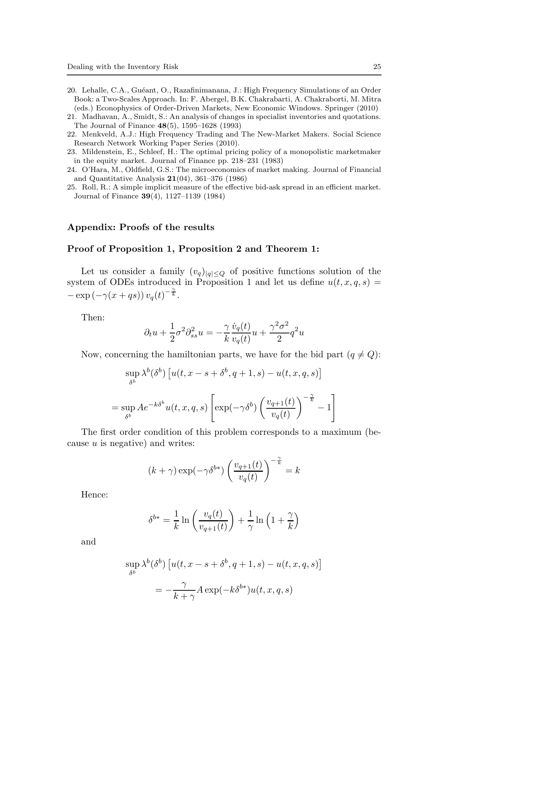

```text
Appendix: Proofs of the results

Proof of Proposition 1, Proposition 2 and Theorem 1:

   Let us consider a family (vq )|q|≤Q of positive functions solution of the
system of ODEs introduced in Proposition 1 and let us define u(t, x, q, s) =
                         −γ
− exp (−γ(x + qs)) vq (t) k .

    Then:
                             1            γ v̇q (t)    γ 2 σ2 2
                       ∂t u + σ 2 ∂ss
                                   2
                                      u=−           u+       q u
                             2            k vq (t)        2
    Now, concerning the hamiltonian parts, we have for the bid part (q 6= Q):
                                                                       
              sup λb (δ b ) u(t, x − s + δ b , q + 1, s) − u(t, x, q, s)
                  δb
                                               "                                − γk        #
                                 b                                    vq+1 (t)
             = sup Ae−kδ u(t, x, q, s) exp(−γδ b )                                       −1
                 δb                                                    vq (t)
   The first order condition of this problem corresponds to a maximum (be-
cause u is negative) and writes:
                                                                  − γk
                                                        vq+1 (t)
                        (k + γ) exp(−γδ b∗ )                               =k
                                                         vq (t)
    Hence:
                                                       
                            b∗    1           vq (t)            1       γ
                        δ        = ln                       +     ln 1 +
                                  k          vq+1 (t)           γ        k
    and
                                                                          
                 sup λb (δ b ) u(t, x − s + δ b , q + 1, s) − u(t, x, q, s)
                  δb
                                      γ
                            =−           A exp(−kδ b∗ )u(t, x, q, s)
                                     k+γ
```


## PDF page 26

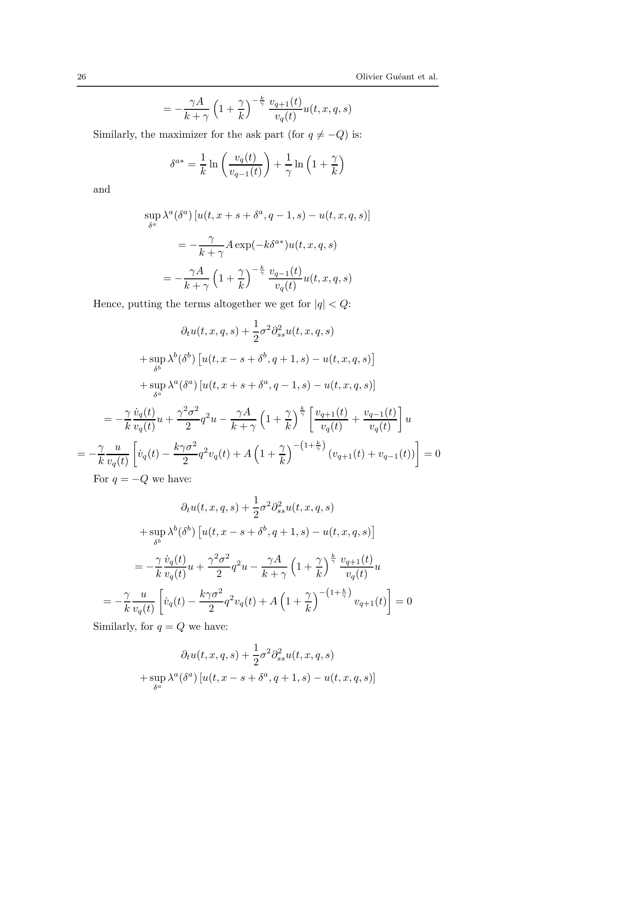

```text
26                                                                      Olivier Guéant et al.

                             γA    γ − γk vq+1 (t)
                       =−        1+                  u(t, x, q, s)
                            k+γ     k        vq (t)
     Similarly, the maximizer for the ask part (for q 6= −Q) is:
                                          
                      a∗   1        vq (t)     1        γ
                     δ = ln                  + ln 1 +
                           k      vq−1 (t)    γ          k
     and

                sup λa (δ a ) [u(t, x + s + δ a , q − 1, s) − u(t, x, q, s)]
                 δa
                              γ
                          =−     A exp(−kδ a∗ )u(t, x, q, s)
                            k+γ
                           γA      γ − kγ vq−1 (t)
                       =−       1+                   u(t, x, q, s)
                          k+γ       k        vq (t)
     Hence, putting the terms altogether we get for |q| < Q:
                                           1
                         ∂t u(t, x, q, s) + σ 2 ∂ss2
                                                     u(t, x, q, s)
                                           2
                                                                          
               + sup λb (δ b ) u(t, x − s + δ b , q + 1, s) − u(t, x, q, s)
                  δb

               + sup λa (δ a ) [u(t, x + s + δ a , q − 1, s) − u(t, x, q, s)]
                  δa
                                                     k                      
          γ v̇q (t)      γ 2σ2 2       γA       γ  γ vq+1 (t) vq−1 (t)
    =−              u+        q u−          1+                   +             u
          k vq (t)         2          k+γ        k       vq (t)       vq (t)
                                                                                
   γ u                  kγσ 2 2               γ −(1+ γk )
=−            v̇q (t) −       q vq (t) + A 1 +              (vq+1 (t) + vq−1 (t)) = 0
   k vq (t)               2                    k
     For q = −Q we have:
                                           1
                         ∂t u(t, x, q, s) + σ 2 ∂ss2
                                                     u(t, x, q, s)
                                           2
                                                                          
               + sup λb (δ b ) u(t, x − s + δ b , q + 1, s) − u(t, x, q, s)
                  δb

                   γ v̇q (t)    γ 2 σ2 2       γA       γ  γk vq+1 (t)
              =−             u+       q u−          1+                   u
                   k vq (t)        2          k+γ        k       vq (t)
                                                                          
          γ u                  kγσ 2 2               γ −(1+ γk )
       =−            v̇q (t) −       q vq (t) + A 1 +              vq+1 (t) = 0
          k vq (t)              2                     k
     Similarly, for q = Q we have:
                                            1
                         ∂t u(t, x, q, s) + σ 2 ∂ss 2
                                                      u(t, x, q, s)
                                            2
               + sup λa (δ a ) [u(t, x − s + δ a , q + 1, s) − u(t, x, q, s)]
                  δa
```


## PDF page 27


```text
Dealing with the Inventory Risk                                                        27

                  γ v̇q (t)    γ 2 σ2 2       γA       γ  γk vq−1 (t)
              =−            u+       q u−          1+                   u
                  k vq (t)        2          k+γ        k       vq (t)
                                                                         
         γ u                  kγσ 2 2               γ −(1+ γk )
      =−            v̇q (t) −       q vq (t) + A 1 +              vq−1 (t) = 0
         k vq (t)              2                     k
   Now, noticing that the terminal condition for vq is consistent with the ter-
minal condition for u, we get that u verifies (HJB) and this proves Proposition
1.

    The positivity of the functions (vq )|q|≤Q was essential in the definition of
u. Hence we need to prove that the solution to the above linear system of ordi-
nary differential equations, namely v(t) = exp(−M (T − t)) × (1, . . . , 1)′ (where
M is given in Proposition 2), defines a family (vq )|q|≤Q of positive functions.

   In fact, we are going to prove that:
                                                                       2
             ∀t ∈ [0, T ], ∀q ∈ {−Q, . . . , Q},      vq (t) ≥ e−(αQ −η)(T −t)

   If this was not true then there would exist ǫ > 0 such that:

                                                  2
                                                             
             min          e−2η(T −t) vq (t) − e−(αQ −η)(T −t) + ǫ(T − t) < 0
         t∈[0,T ],|q|≤Q

   But this minimum is achieved at some point (t∗ , q ∗ ) with t∗ < T and hence:

                  d −2η(T −t)                2
                                                         
                     e         vq∗ (t) − e−(αQ −η)(T −t)        ≥ǫ
                  dt                                       t=t∗
   This gives:
                                 ∗
                                                   2       ∗
                                                              
                   2ηe−2η(T −t ) vq∗ (t∗ ) − e−(αQ −η)(T −t )
                       ∗
                                                     2        ∗
                                                                 
             +e−2η(T −t ) vq′ ∗ (t∗ ) − (αQ2 − η)e−(αQ −η)(T −t ) ≥ ǫ

Hence:
                                                           2       ∗              ∗
         2ηvq∗ (t∗ ) + vq′ ∗ (t∗ ) − (η + αQ2 )e−(αQ −η)(T −t ) ≥ ǫe2η(T −t )

   Now, if |q ∗ | < Q, this gives:

                 αq ∗ 2 vq∗ (t∗ ) − η(vq∗ +1 (t∗ ) − 2vq∗ (t∗ ) + vq∗ −1 (t∗ ))
                                            2          ∗               ∗
                      −(η + αQ2 )e−(αQ −η)(T −t ) ≥ ǫe2η(T −t )
Thus:
                          2
                                      
   αq ∗ 2 vq∗ (t∗ ) − e−(αQ −η)(T −t ) − η(vq∗ +1 (t∗ ) − 2vq∗ (t∗ ) + vq∗ −1 (t∗ ))
                                    ∗


                                                 2
                 −(η + α(Q2 − q ∗ 2 ))e−(αQ −η)(T −t ) ≥ ǫe2η(T −t )
                                                               ∗            ∗
```


## PDF page 28

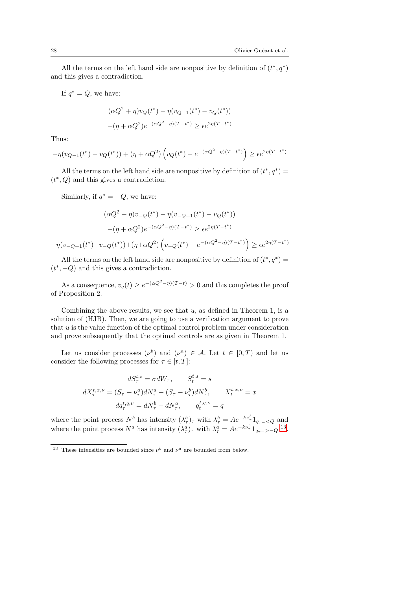

```text
28                                                                        Olivier Guéant et al.


   All the terms on the left hand side are nonpositive by definition of (t∗ , q ∗ )
and this gives a contradiction.

     If q ∗ = Q, we have:

                      (αQ2 + η)vQ (t∗ ) − η(vQ−1 (t∗ ) − vQ (t∗ ))
                                          2         ∗                 ∗
                      −(η + αQ2 )e−(αQ −η)(T −t ) ≥ ǫe2η(T −t )
Thus:
                                                      2        ∗
                                                                             ∗
−η(vQ−1 (t∗ ) − vQ (t∗ )) + (η + αQ2 ) vQ (t∗ ) − e−(αQ −η)(T −t ) ≥ ǫe2η(T −t )

    All the terms on the left hand side are nonpositive by definition of (t∗ , q ∗ ) =
 ∗
(t , Q) and this gives a contradiction.

     Similarly, if q ∗ = −Q, we have:

                     (αQ2 + η)v−Q (t∗ ) − η(v−Q+1 (t∗ ) − vQ (t∗ ))
                                          2         ∗                 ∗
                 −(η + αQ2 )e−(αQ −η)(T −t ) ≥ ǫe2η(T −t )
                                                   2        ∗
                                                                          ∗
−η(v−Q+1 (t∗ )−v−Q (t∗ ))+(η+αQ2 ) v−Q (t∗ ) − e−(αQ −η)(T −t ) ≥ ǫe2η(T −t )

    All the terms on the left hand side are nonpositive by definition of (t∗ , q ∗ ) =
 ∗
(t , −Q) and this gives a contradiction.
                                          2
    As a consequence, vq (t) ≥ e−(αQ −η)(T −t) > 0 and this completes the proof
of Proposition 2.

    Combining the above results, we see that u, as defined in Theorem 1, is a
solution of (HJB). Then, we are going to use a verification argument to prove
that u is the value function of the optimal control problem under consideration
and prove subsequently that the optimal controls are as given in Theorem 1.

   Let us consider processes (ν b ) and (ν a ) ∈ A. Let t ∈ [0, T ) and let us
consider the following processes for τ ∈ [t, T ]:

                              dSτt,s = σdWτ ,       Stt,s = s
             dXτt,x,ν = (Sτ + ντa )dNτa − (Sτ − ντb )dNτb ,           Xtt,x,ν = x
                         dqτt,q,ν = dNτb − dNτa ,       qtt,q,ν = q
                                                                                b
where the point process N b has intensity (λbτ )τ with λbτ = Ae−kντ 1qτ − <Q and
                                                                  a
where the point process N a has intensity (λaτ )τ with λaτ = Ae−kντ 1qτ − >−Q 13 .

13   These intensities are bounded since ν b and ν a are bounded from below.
```


## PDF page 29

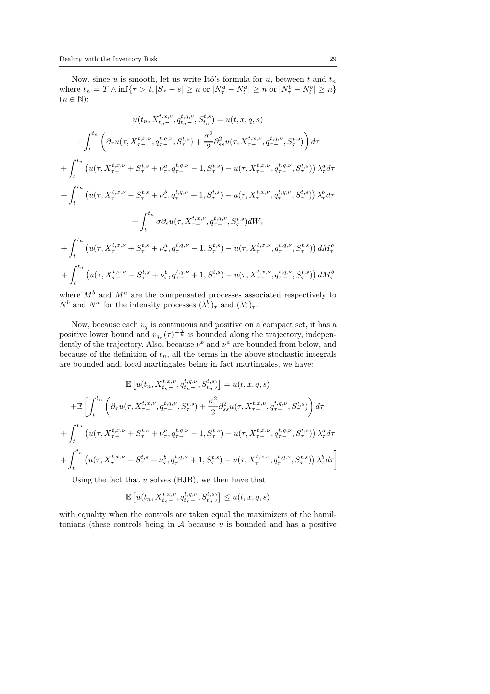

```text
Dealing with the Inventory Risk                                                                      29


   Now, since u is smooth, let us write Itô’s formula for u, between t and tn
where tn = T ∧ inf{τ > t, |Sτ − s| ≥ n or |Nτa − Nta | ≥ n or |Nτb − Ntb | ≥ n}
(n ∈ N):

                             u(tn , Xtt,x,ν
                                       n−
                                            , qtt,q,ν
                                                 n−
                                                      , Stt,s
                                                           n
                                                              ) = u(t, x, q, s)
             Z tn                                                                            
                                                        σ2 2
         +            ∂τ u(τ, Xτt,x,ν t,q,ν  t,s
                                 − , qτ − , Sτ ) +        ∂ss u(τ, Xτt,x,ν
                                                                      −    , q t,q,ν
                                                                              τ−     , S t,s
                                                                                         τ   )  dτ
              t                                         2
    Z tn
                                                                              a
+             u(τ, Xτt,x,ν t,s  a t,q,ν        t,s         t,x,ν t,q,ν   t,s
                      − + Sτ + ντ , qτ − − 1, Sτ ) − u(τ, Xτ − , qτ − , Sτ ) λτ dτ
     t
    Z tn
                                                                              b
+             u(τ, Xτt,x,ν t,s  b t,q,ν        t,s         t,x,ν t,q,ν   t,s
                      − − Sτ + ντ , qτ − + 1, Sτ ) − u(τ, Xτ − , qτ − , Sτ ) λτ dτ
     t
                                 Z tn
                             +          σ∂s u(τ, Xτt,x,ν t,q,ν  t,s
                                                    − , qτ − , Sτ )dWτ
                                  t
    Z tn
                                                                             
+             u(τ, Xτt,x,ν t,s  a t,q,ν        t,s         t,x,ν t,q,ν   t,s   a
                      − + Sτ + ντ , qτ − − 1, Sτ ) − u(τ, Xτ − , qτ − , Sτ ) dMτ
     t
    Z tn
                                                                             
+             u(τ, Xτt,x,ν t,s  b t,q,ν        t,s         t,x,ν t,q,ν   t,s   b
                      − − Sτ + ντ , qτ − + 1, Sτ ) − u(τ, Xτ − , qτ − , Sτ ) dMτ
     t

where M b and M a are the compensated processes associated respectively to
N b and N a for the intensity processes (λbτ )τ and (λaτ )τ .

   Now, because each vq is continuous and positive on a compact set, it has a
                                     γ
positive lower bound and vqτ (τ )− k is bounded along the trajectory, indepen-
dently of the trajectory. Also, because ν b and ν a are bounded from below, and
because of the definition of tn , all the terms in the above stochastic integrals
are bounded and, local martingales being in fact martingales, we have:
                                                              
                           E u(tn , Xtt,x,ν
                                       n−
                                            , qtt,q,ν
                                                 n−
                                                      , Stt,s
                                                           n
                                                              ) = u(t, x, q, s)
       Z tn                                                            
                       t,x,ν t,q,ν   t,s   σ2 2       t,x,ν t,q,ν   t,s
  +E          ∂τ u(τ, Xτ − , qτ − , Sτ ) +    ∂ u(τ, Xτ − , qτ − , Sτ ) dτ
         t                                 2 ss
  Z tn
                                                                           a
+       u(τ, Xτt,x,ν   t,s    a t,q,ν       t,s         t,x,ν t,q,ν   t,s
                − + Sτ + ντ , qτ − − 1, Sτ ) − u(τ, Xτ − , qτ − , Sτ ) λτ dτ
     t
    Z tn                                                                                              
                                                                              b
+             u(τ, Xτt,x,ν t,s  b t,q,ν        t,s         t,x,ν t,q,ν   t,s
                      − − Sτ + ντ , qτ − + 1, Sτ ) − u(τ, Xτ − , qτ − , Sτ ) λτ dτ
     t

     Using the fact that u solves (HJB), we then have that
                                                       
                    E u(tn , Xtt,x,ν
                                n−
                                     , qtt,q,ν
                                          n−
                                               , Stt,s
                                                    n
                                                       ) ≤ u(t, x, q, s)

with equality when the controls are taken equal the maximizers of the hamil-
tonians (these controls being in A because v is bounded and has a positive
```


## PDF page 30

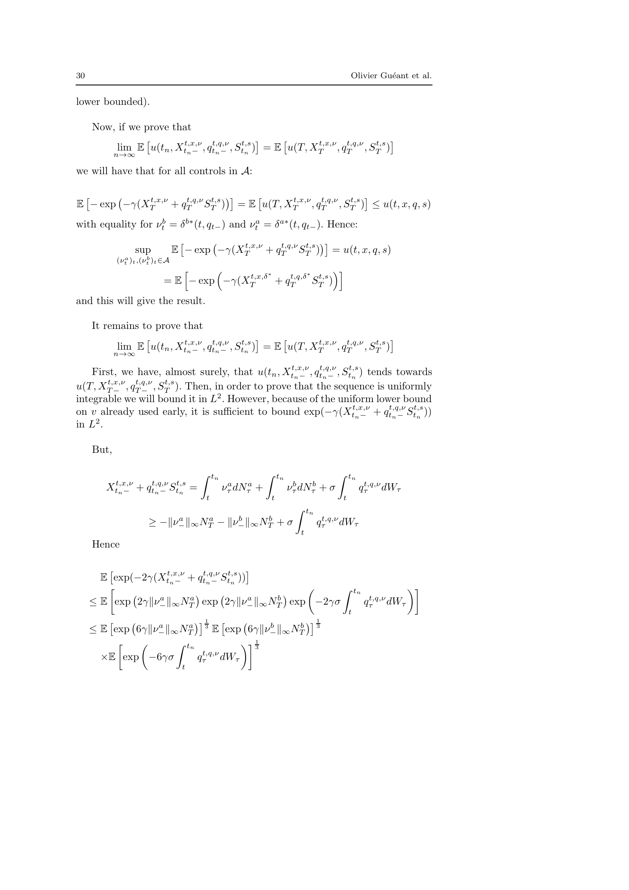

```text
30                                                                                         Olivier Guéant et al.


lower bounded).

     Now, if we prove that
                                                                                    
          lim E u(tn , Xtt,x,ν
                          n−
                               , qtt,q,ν
                                    n−
                                         , Stt,s
                                              n
                                                 ) = E u(T, XTt,x,ν , qTt,q,ν , STt,s )
             n→∞

we will have that for all controls in A:

                                                                     
E − exp −γ(XTt,x,ν + qTt,q,ν STt,s ) = E u(T, XTt,x,ν , qTt,q,ν , STt,s ) ≤ u(t, x, q, s)
with equality for νtb = δ b∗ (t, qt− ) and νta = δ a∗ (t, qt− ). Hence:
                                                                      
                   sup             E − exp −γ(XTt,x,ν + qTt,q,ν STt,s ) = u(t, x, q, s)
             (νta )t ,(νtb )t ∈A
                                h               ∗         ∗
                                                                   i
                             = E − exp −γ(XTt,x,δ + qTt,q,δ STt,s )
and this will give the result.

     It remains to prove that
                                                                                     
           lim E u(tn , Xtt,x,ν
                           n−
                                , qtt,q,ν
                                     n−
                                          , Stt,s
                                               n
                                                  ) = E u(T, XTt,x,ν , qTt,q,ν , STt,s )
             n→∞

    First, we have, almost surely, that u(tn , Xtt,x,ν
                                                  n−
                                                       , qtt,q,ν
                                                            n−
                                                                 , Stt,s
                                                                      n
                                                                         ) tends towards
        t,x,ν t,q,ν t,s
u(T, XT − , qT − , ST ). Then, in order to prove that the sequence is uniformly
integrable we will bound it in L2 . However, because of the uniform lower bound
on v already used early, it is sufficient to bound exp(−γ(Xtt,x,ν      n−
                                                                            + qtt,q,ν
                                                                                 n−
                                                                                      Stt,s
                                                                                         n
                                                                                            ))
in L2 .

     But,

                                           Z tn                Z tn                  Z tn
        Xtt,x,ν
           n−
                + qtt,q,ν
                     n−
                          Stt,s
                             n
                                =                 ντa dNτa +          ντb dNτb + σ             qτt,q,ν dWτ
                                             t                  t                      t
                                                                        Z tn
                             a
                        ≥ −kν− k∞ NTa − kν−
                                          b
                                            k∞ NTb + σ                          qτt,q,ν dWτ
                                                                         t
     Hence

                                          
       E exp(−2γ(Xtt,x,ν
                    n−
                         + qtt,q,ν
                              n−
                                   Stt,s
                                      n
                                         ))
                                                  Z tn        
                 a       a
                                           a b
                                                         t,q,ν
     ≤ E exp 2γkν− k∞ NT exp 2γkν− k∞ NT exp −2γσ        qτ dWτ
                                                                                           t
                      a
                                          31                               13
     ≤ E exp       6γkν− k∞ NTa
                            E exp                           b
                                                        6γkν− k∞ NTb
                 Z tn           13
                         t,q,ν
       ×E exp −6γσ      qτ dWτ
                                     t
```


## PDF page 31

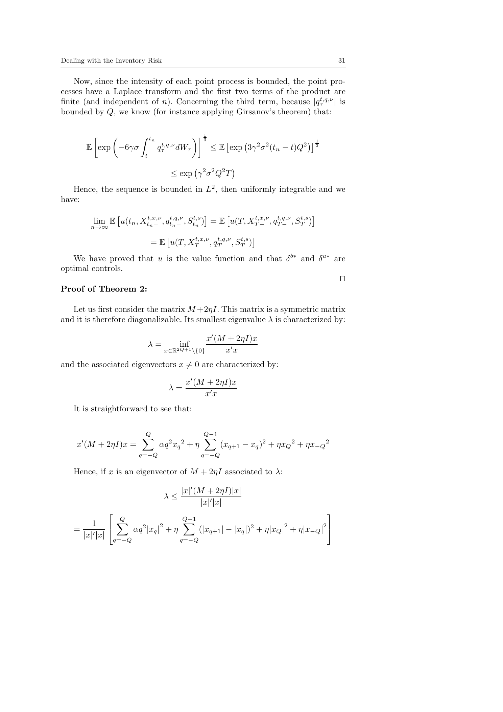

```text
Dealing with the Inventory Risk                                                           31


    Now, since the intensity of each point process is bounded, the point pro-
cesses have a Laplace transform and the first two terms of the product are
finite (and independent of n). Concerning the third term, because |qτt,q,ν | is
bounded by Q, we know (for instance applying Girsanov’s theorem) that:

                       Z tn                   13
                                                                                  1
          E exp −6γσ             qτt,q,ν dWτ           ≤ E exp 3γ 2 σ 2 (tn − t)Q2 3
                           t
                                                             
                                      ≤ exp γ 2 σ 2 Q2 T
   Hence, the sequence is bounded in L2 , then uniformly integrable and we
have:
                                                                          t,s 
           lim E u(tn , Xtt,x,ν
                           n−
                                , qtt,q,ν
                                     n−
                                          , Stt,s
                                               n
                                                  ) = E u(T, XTt,x,ν  t,q,ν
                                                                 − , qT − , ST )
          n→∞
                                                                  
                               = E u(T, XTt,x,ν , qTt,q,ν , STt,s )
   We have proved that u is the value function and that δ b∗ and δ a∗ are
optimal controls.
                                                                       ⊓
                                                                       ⊔
Proof of Theorem 2:

   Let us first consider the matrix M +2ηI. This matrix is a symmetric matrix
and it is therefore diagonalizable. Its smallest eigenvalue λ is characterized by:

                                                 x′ (M + 2ηI)x
                               λ=        inf
                                    x∈R2Q+1 \{0}      x′ x
and the associated eigenvectors x 6= 0 are characterized by:

                                             x′ (M + 2ηI)x
                                     λ=
                                                  x′ x
   It is straightforward to see that:

                          Q
                          X                        Q−1
                                                   X
      ′                              2   2
    x (M + 2ηI)x =                αq xq + η              (xq+1 − xq )2 + ηxQ 2 + ηx−Q 2
                         q=−Q                     q=−Q

   Hence, if x is an eigenvector of M + 2ηI associated to λ:

                                         |x|′ (M + 2ηI)|x|
                                    λ≤
                                                |x|′ |x|
                                                                           
                Q                Q−1
        1  X               2
                                 X                              2         2
   =              αq 2 |xq | + η     (|xq+1 | − |xq |)2 + η|xQ | + η|x−Q | 
     |x|′ |x|
                 q=−Q                    q=−Q
```


## PDF page 32

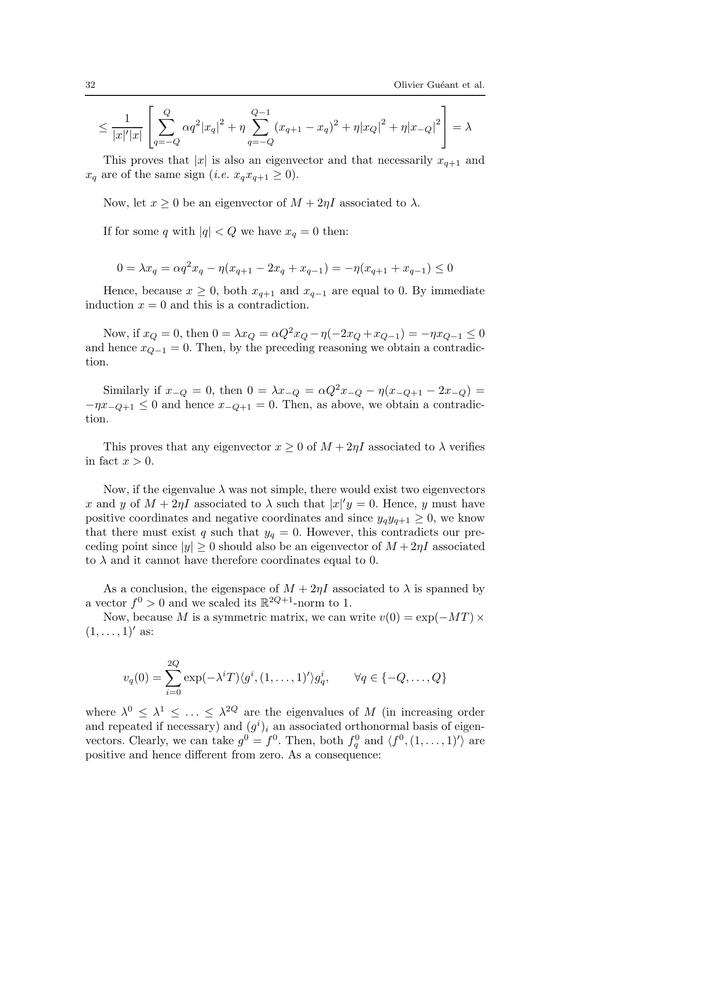

```text
32                                                                           Olivier Guéant et al.
                                                                        
                  Q                Q−1
          1  X               2
                                   X                         2         2
     ≤              αq 2 |xq | + η     (xq+1 − xq )2 + η|xQ | + η|x−Q |  = λ
       |x|′ |x|
               q=−Q                        q=−Q

   This proves that |x| is also an eigenvector and that necessarily xq+1 and
xq are of the same sign (i.e. xq xq+1 ≥ 0).

     Now, let x ≥ 0 be an eigenvector of M + 2ηI associated to λ.

     If for some q with |q| < Q we have xq = 0 then:


        0 = λxq = αq 2 xq − η(xq+1 − 2xq + xq−1 ) = −η(xq+1 + xq−1 ) ≤ 0
   Hence, because x ≥ 0, both xq+1 and xq−1 are equal to 0. By immediate
induction x = 0 and this is a contradiction.

    Now, if xQ = 0, then 0 = λxQ = αQ2 xQ − η(−2xQ + xQ−1 ) = −ηxQ−1 ≤ 0
and hence xQ−1 = 0. Then, by the preceding reasoning we obtain a contradic-
tion.

    Similarly if x−Q = 0, then 0 = λx−Q = αQ2 x−Q − η(x−Q+1 − 2x−Q ) =
−ηx−Q+1 ≤ 0 and hence x−Q+1 = 0. Then, as above, we obtain a contradic-
tion.

    This proves that any eigenvector x ≥ 0 of M + 2ηI associated to λ verifies
in fact x > 0.

   Now, if the eigenvalue λ was not simple, there would exist two eigenvectors
x and y of M + 2ηI associated to λ such that |x|′ y = 0. Hence, y must have
positive coordinates and negative coordinates and since yq yq+1 ≥ 0, we know
that there must exist q such that yq = 0. However, this contradicts our pre-
ceding point since |y| ≥ 0 should also be an eigenvector of M + 2ηI associated
to λ and it cannot have therefore coordinates equal to 0.

     As a conclusion, the eigenspace of M + 2ηI associated to λ is spanned by
a vector f 0 > 0 and we scaled its R2Q+1 -norm to 1.
     Now, because M is a symmetric matrix, we can write v(0) = exp(−M T ) ×
(1, . . . , 1)′ as:

                    2Q
                    X
         vq (0) =         exp(−λi T )hg i , (1, . . . , 1)′ igqi ,   ∀q ∈ {−Q, . . . , Q}
                    i=0

where λ0 ≤ λ1 ≤ . . . ≤ λ2Q are the eigenvalues of M (in increasing order
and repeated if necessary) and (g i )i an associated orthonormal basis of eigen-
vectors. Clearly, we can take g 0 = f 0 . Then, both fq0 and hf 0 , (1, . . . , 1)′ i are
positive and hence different from zero. As a consequence:
```


## PDF page 33

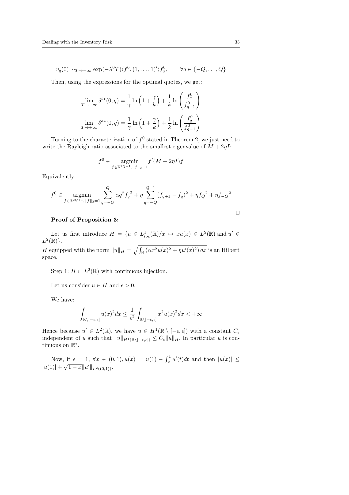

```text
Dealing with the Inventory Risk                                                               33


      vq (0) ∼T →+∞ exp(−λ0 T )hf 0 , (1, . . . , 1)′ ifq0 ,          ∀q ∈ {−Q, . . . , Q}

     Then, using the expressions for the optimal quotes, we get:
                                                              !
                        b∗         1        γ 1         fq0
                  lim δ (0, q) = ln 1 +         + ln      0
                T →+∞              γ         k    k      fq+1
                                                              !
                                                            0
                                   1        γ  1        f q
                  lim δ a∗ (0, q) = ln 1 +      + ln      0
                T →+∞              γ         k    k      fq−1

   Turning to the characterization of f 0 stated in Theorem 2, we just need to
write the Rayleigh ratio associated to the smallest eigenvalue of M + 2ηI:

                           f0 ∈         argmin         f ′ (M + 2ηI)f
                                  f ∈R2Q+1 ,kf k2 =1

Equivalently:
                              Q
                              X                       Q−1
                                                      X
     f0 ∈       argmin                αq 2 fq 2 + η          (fq+1 − fq )2 + ηfQ 2 + ηf−Q 2
            f ∈R2Q+1 ,kf k2 =1 q=−Q                   q=−Q

                                                                                              ⊓
                                                                                              ⊔
     Proof of Proposition 3:

   Let us first introduce H = {u ∈ L1loc (R)/x 7→ xu(x) ∈ L2 (R) and u′ ∈
 2
L (R)}.                          qR
H equipped with the norm kukH =    R
                                      (αx2 u(x)2 + ηu′ (x)2 ) dx is an Hilbert
space.

     Step 1: H ⊂ L2 (R) with continuous injection.

     Let us consider u ∈ H and ǫ > 0.

     We have:
                   Z                            Z
                                  2    1
                             u(x) dx ≤ 2                     x2 u(x)2 dx < +∞
                    R\[−ǫ,ǫ]          ǫ          R\[−ǫ,ǫ]

Hence because u′ ∈ L2 (R), we have u ∈ H 1 (R \ [−ǫ, ǫ]) with a constant Cǫ
independent of u such that kukH 1 (R\[−ǫ,ǫ]) ≤ Cǫ kukH . In particular u is con-
tinuous on R∗ .
                                                                R1  ′
    Now, if ǫ = 1, ∀x ∈ (0, 1), u(x) = u(1) −                    x u (t)dt and then |u(x)|    ≤
        √
|u(1)| + 1 − xku′ kL2 ((0,1)) .
```


## PDF page 34

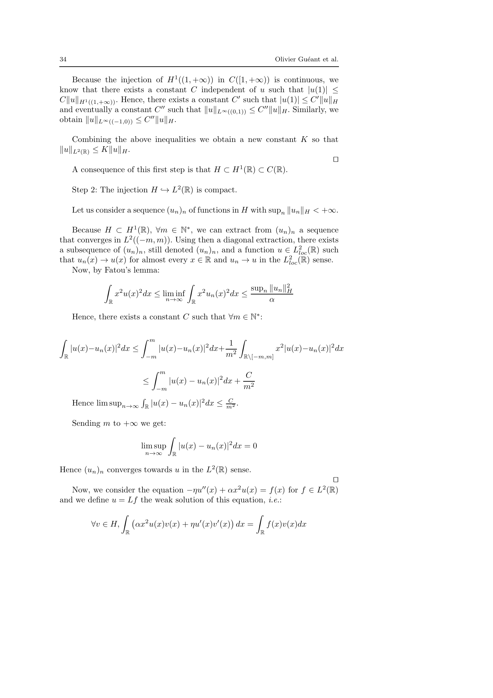

```text
34                                                                         Olivier Guéant et al.


   Because the injection of H 1 ((1, +∞)) in C([1, +∞)) is continuous, we
know that there exists a constant C independent of u such that |u(1)| ≤
CkukH 1 ((1,+∞)) . Hence, there exists a constant C ′ such that |u(1)| ≤ C ′ kukH
and eventually a constant C ′′ such that kukL∞((0,1)) ≤ C ′′ kukH . Similarly, we
obtain kukL∞ ((−1,0)) ≤ C ′′ kukH .

   Combining the above inequalities we obtain a new constant K so that
kukL2(R) ≤ KkukH .
                                                                    ⊓
                                                                    ⊔
   A consequence of this first step is that H ⊂ H 1 (R) ⊂ C(R).

     Step 2: The injection H ֒→ L2 (R) is compact.

     Let us consider a sequence (un )n of functions in H with supn kun kH < +∞.

   Because H ⊂ H 1 (R), ∀m ∈ N∗ , we can extract from (un )n a sequence
that converges in L2 ((−m, m)). Using then a diagonal extraction, there exists
a subsequence of (un )n , still denoted (un )n , and a function u ∈ L2loc (R) such
that un (x) → u(x) for almost every x ∈ R and un → u in the L2loc (R) sense.
   Now, by Fatou’s lemma:
            Z                         Z
                 2     2                                 supn kun k2H
               x u(x) dx ≤ lim inf       x2 un (x)2 dx ≤
             R                  n→∞    R                      α

     Hence, there exists a constant C such that ∀m ∈ N∗ :

Z                          Z m                                Z
                                                         1
     |u(x)−un (x)|2 dx ≤            |u(x)−un (x)|2 dx+                     x2 |u(x)−un (x)|2 dx
 R                             −m                        m2   R\[−m,m]

                                Z m
                                                              C
                           ≤          |u(x) − un (x)|2 dx +
                                 −m                           m2
                           R
     Hence lim supn→∞ R |u(x) − un (x)|2 dx ≤ mC2 .

     Sending m to +∞ we get:
                                      Z
                           lim sup         |u(x) − un (x)|2 dx = 0
                               n→∞     R

Hence (un )n converges towards u in the L2 (R) sense.
                                                                           ⊓
                                                                           ⊔
   Now, we consider the equation −ηu′′ (x) + αx2 u(x) = f (x) for f ∈ L2 (R)
and we define u = Lf the weak solution of this equation, i.e.:
                    Z                                              Z
                                                     
          ∀v ∈ H,       αx2 u(x)v(x) + ηu′ (x)v ′ (x) dx =               f (x)v(x)dx
                    R                                                R
```


## PDF page 35

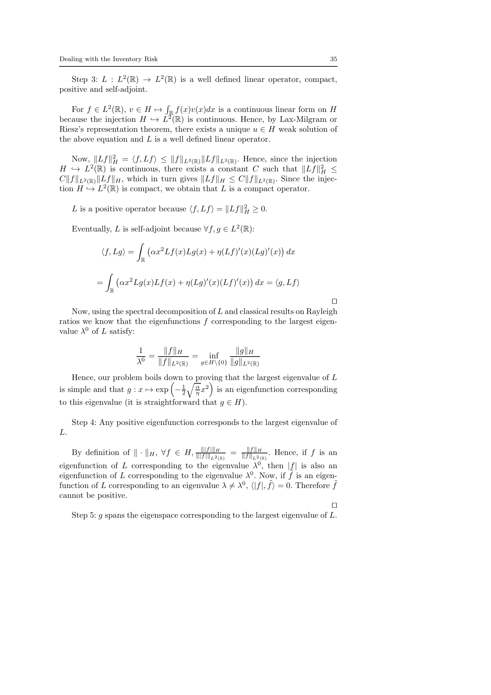

```text
Dealing with the Inventory Risk                                                  35


   Step 3: L : L2 (R) → L2 (R) is a well defined linear operator, compact,
positive and self-adjoint.
                             R
   For f ∈ L2 (R), v ∈ H 7→ R f (x)v(x)dx is a continuous linear form on H
because the injection H ֒→ L2 (R) is continuous. Hence, by Lax-Milgram or
Riesz’s representation theorem, there exists a unique u ∈ H weak solution of
the above equation and L is a well defined linear operator.

    Now, kLf k2H = hf, Lf i ≤ kf kL2(R) kLf kL2(R) . Hence, since the injection
H ֒→ L2 (R) is continuous, there exists a constant C such that kLf k2H ≤
Ckf kL2 (R) kLf kH , which in turn gives kLf kH ≤ Ckf kL2 (R) . Since the injec-
tion H ֒→ L2 (R) is compact, we obtain that L is a compact operator.

     L is a positive operator because hf, Lf i = kLf k2H ≥ 0.

     Eventually, L is self-adjoint because ∀f, g ∈ L2 (R):
                        Z
                                                                  
            hf, Lgi =       αx2 Lf (x)Lg(x) + η(Lf )′ (x)(Lg)′ (x) dx
                          R

                Z
                                                          
            =       αx2 Lg(x)Lf (x) + η(Lg)′ (x)(Lf )′ (x) dx = hg, Lf i
                R
                                                                               ⊓
                                                                               ⊔
    Now, using the spectral decomposition of L and classical results on Rayleigh
ratios we know that the eigenfunctions f corresponding to the largest eigen-
value λ0 of L satisfy:

                        1     kf kH               kgkH
                         0
                           =            = inf
                        λ    kf kL2 (R)  g∈H\{0} kgkL2 (R)

    Hence, our problem boils down
                                to q proving
                                           that the largest eigenvalue of L
is simple and that g : x 7→ exp − 12 αη x2 is an eigenfunction corresponding
to this eigenvalue (it is straightforward that g ∈ H).

     Step 4: Any positive eigenfunction corresponds to the largest eigenvalue of
L.

     By definition of k · kH , ∀f ∈ H, k|fk|f |kH
                                            |k 2      = kfkf kH
                                                           k 2  . Hence, if f is an
                                              L (R)        L (R)

eigenfunction of L corresponding to the eigenvalue λ0 , then |f | is also an
eigenfunction of L corresponding to the eigenvalue λ0 . Now, if f˜ is an eigen-
function of L corresponding to an eigenvalue λ 6= λ0 , h|f |, f˜i = 0. Therefore f˜
cannot be positive.
                                                                                 ⊓
                                                                                 ⊔
    Step 5: g spans the eigenspace corresponding to the largest eigenvalue of L.
```


## PDF page 36

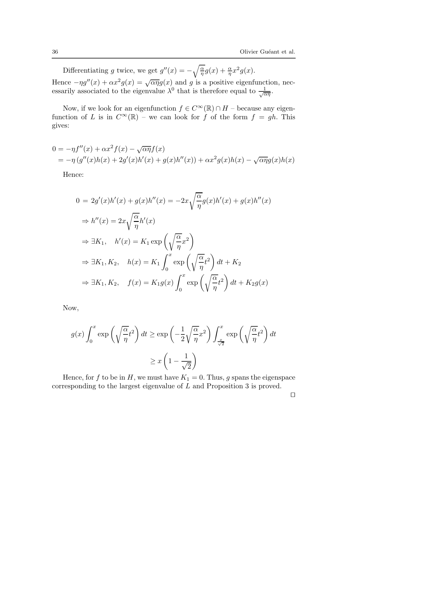

```text
36                                                             Olivier Guéant et al.

                                                q
    Differentiating g twice, we get g ′′ (x) = − αη g(x) + αη x2 g(x).
                               √
Hence −ηg ′′ (x) + αx2 g(x) = αηg(x) and g is a positive eigenfunction, nec-
essarily associated to the eigenvalue λ0 that is therefore equal to √1αη .

   Now, if we look for an eigenfunction f ∈ C ∞ (R) ∩ H – because any eigen-
function of L is in C ∞ (R) – we can look for f of the form f = gh. This
gives:

                                  √
0 = −ηf ′′ (x) + αx2 f (x) −       αηf (x)
                                                                       √
 = −η (g ′′ (x)h(x) + 2g ′ (x)h′ (x) + g(x)h′′ (x)) + αx2 g(x)h(x) −       αηg(x)h(x)

     Hence:

                                             r
                    ′     ′           ′′       α
        0 = 2g (x)h (x) + g(x)h (x) = −2x        g(x)h′ (x) + g(x)h′′ (x)
                                               η
                        r
             ′′           α ′
          ⇒ h (x) = 2x      h (x)
                          η
                                   r        
                      ′                α 2
          ⇒ ∃K1 , h (x) = K1 exp          x
                                       η
                                  Z x      r       
                                                α 2
          ⇒ ∃K1 , K2 , h(x) = K1      exp         t dt + K2
                                   0            η
                                       Z x      r       
                                                    α 2
          ⇒ ∃K1 , K2 , f (x) = K1 g(x)      exp        t dt + K2 g(x)
                                        0            η

     Now,

              Z x         r                 r    Z x     r     
                               α 2            1 α 2             α 2
       g(x)         exp          t dt ≥ exp −     x      exp      t dt
               0               η              2 η     √x        η
                                                         2

                                               
                                           1
                                     ≥x 1− √
                                            2
   Hence, for f to be in H, we must have K1 = 0. Thus, g spans the eigenspace
corresponding to the largest eigenvalue of L and Proposition 3 is proved.
                                                                           ⊓
                                                                           ⊔
```
